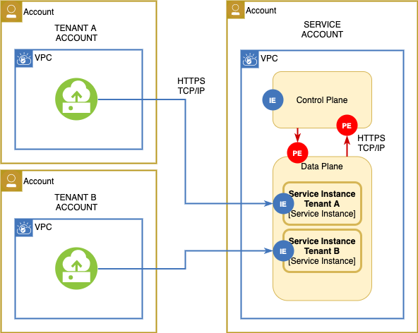

---

copyright:
  years: 2020
lastupdated: "2020-10-26"

keywords: SQL query, security, enhancing security, deployment model

subcollection: sql-query

---

{:new_window: target="_blank"}
{:shortdesc: .shortdesc}
{:screen: .screen}
{:codeblock: .codeblock}
{:pre: .pre}

# Deployment model
{:deployment}

{{site.data.keyword.sqlquery_full}}'s Deployment Model corresponds to a public service with public endpoints.
It is the publicly shared multi-tenant deployment model for IBM Services, and as such, this model is not dedicated. 
The service is accessed via public endpoints. Both, the control and data plane of the service, are shared across tenants.

Tenant isolation models | Tenant domain isolation | Endpoint isolation | Compute isolation | Storage isolation | Network isolation
--- | --- | --- | --- | --- | ---
Shared data plane | Service account | Public endpoint | Shared physical hosts | Shared physical storage devices, shared access endpoint | Service virtual network

