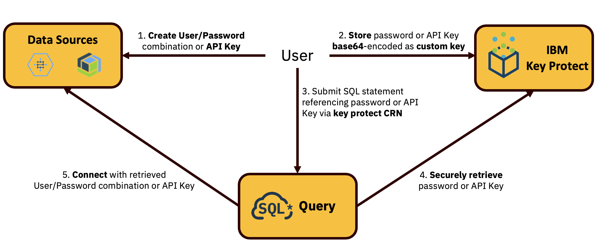

---

copyright:
  year: 2018, 2020
lastupdated: "2020-01-08"

keywords: security, gdpr, hipaa, compliance, personal data, personal information, privacy policy, cloud notice, terms of use

subcollection: sql-query

---

{:shortdesc: .shortdesc}
{:new_window: target="_blank"}
{:codeblock: .codeblock}
{:pre: .pre}
{:screen: .screen}
{:tip: .tip}

# Security and compliance
{: #security}

## Authentication
{: #authentication}

The {{site.data.keyword.sqlquery_full}} service is tightly integrated with {{site.data.keyword.iamlong}} (IAM). 
In order to perform an action using the {{site.data.keyword.sqlquery_short}} user interface or API, you require an IAM user ID, which is an IBM ID with an 
IBM Cloud account. {{site.data.keyword.sqlquery_short}} then verifies whether you are authorized to work with the service instance.

### Authenticating access to data resources in SQL Query
{: #accessauthentication}

#### SSO via IAM
{: #iamsso}

IAM is also the preferred and the default mechanism for authenticating access to downstream data resources that are referenced by your SQL queries. If you use it, 
ensure that the user ID you use to submit the SQL query through the web console or the API is also authorized to read the input locations 
(referenced in the `FROM` clauses of the query), and to write the result set to the target location (referenced in the `INTO` clause of the query). 
This mechanism provides seamless single sign-on (SSO) for your query submissions in {{site.data.keyword.sqlquery_short}}. 
You can use the following alternative methods for authenticating access to data resources:

##### IBM Cloud service credentials
{: #servicecredentials}

You can use the unique CRN of a service instance in {{site.data.keyword.Bluemix_notm}} to address a resource location. 
The credentials for accessing this data resource are retrieved from the Credentials object of that service instance. 
This requires the that IAM user ID that is used to submit the query has the operator role for the service instance of the corresponding data resource.

##### Custom user ID and password for each data resource
{: #userpassword}

You can use the USER and PASSWORD keywords in the corresponding FROM or INTO clauses to securely pass user ID and password for each resource location. 
To ensure that the passing of sensitive data is secure, you must first store the password as a custom standard key in an instance of 
{{site.data.keyword.keymanagementserviceshort}} to which you have access, and then pass it in a CRN to that key instead of the plain text password. 
See [Setting up custom secrets in Key Protect](#kpsetup) for more information about how to store the password securely.

##### Custom API key for each data resource
{: #apikey}

As an alternative to providing user and password combinations, {{site.data.keyword.Bluemix_notm}} also allows you to securely pass API keys 
for each resource location. Using the `APIKEY` keyword inside the according `FROM` or `INTO` clauses, you can pass in this information. 
To ensure that the passing of sensitive data is secure, you must first store the API key as a custom standard key in a 
{{site.data.keyword.keymanagementserviceshort}} service instance to which you have access, and then pass it in a CRN to that 
key instead of the plain text API key. See [Setting up custom secrets in Key Protect](#kpsetup) for more information about how to store the API key securely.

#### Currently supported authentication methods per data resource
{: #supportedauthentication}

| Authentication Method                 | COS   | Db2 on Cloud | Db2 Warehouse on Cloud |
| ---                                   | :---: | :---:        | :---:                  |
| IAM SSO                               | yes   | Enterprise   | Enterprise             |
| CRN with Service Credentials          | no    | yes          | yes                    |
| User and password via Key Protect CRN | no    | yes          | yes                    |
| API key via Key Protect CRN           | no    | Enterprise   | Enterprise             |

### Setting up custom secrets in Key Protect
{: #kpsetup}

{{site.data.keyword.keymanagementservicefull}} is the recommended service for storing and managing secrets in {{site.data.keyword.Bluemix_notm}}. It also allows to upload custom secrets and manages them for you. {{site.data.keyword.keymanagementserviceshort}} ensures that only those users and services to whom you have explicitly granted permission are able to access and use secrets. {{site.data.keyword.sqlquery_short}} uses {{site.data.keyword.keymanagementserviceshort}} as its secure and trusted credential broker for custom access secrets to data resources 
as the following diagram shows.



Make sure that you have provisioned or have been given access to an instance of {{site.data.keyword.keymanagementserviceshort}} in 
{{site.data.keyword.Bluemix_notm}}. The following description uses the command line interface to set up a new custom key. 
Alternatively, you can also use the {{site.data.keyword.Bluemix_notm}} console.

1. Log on to {{site.data.keyword.Bluemix_notm}} with `ibmcloud login --sso`
2. Install the {{site.data.keyword.keymanagementserviceshort}} CLI plugin, if it is not already installed: `ibmcloud plugin install key-protect -r 'IBM Cloud'`. 
For more information, see the [documentation](/docs/services/key-protect?topic=key-protect-set-up-cli).
3. List your {{site.data.keyword.keymanagementserviceshort}} service instances and identify the ID and region of the instance where you want to store the secret: 
`ibmcloud resource service-instances --long --service-name kms`. The instance ID is in output column "GUID", the region in column "Location".
4. Select the appropriate target region with `ibmcloud kp region-set <region>`
5. Optionally review the existing keys in the instance with following command:  `ibmcloud kp list -c -i <kp instance id>`
6. {{site.data.keyword.keymanagementserviceshort}} accepts only base64 encoded secret data. Issue the following command to add a custom secret as properly 
encoded content to Key Protect: ``ibmcloud kp create "<key name>" -i <kp instance id> -s -k `echo -ne "<your custom secret>" | base64` ``. The key name that 
you provide is for your reference only and can be an arbitrary string.
7. List the keys again (as in step 5) to retrieve the key ID and CRN for the new key that you just created. Use the key CRN in an 
[access secret clause](/docs/services/sql-query?topic=sql-query-sql-reference#accessSecrets) of an SQL query.

You can verify the correct setup and function of your IBM Cloud CLI by downloading and running <a href="kp_check.sh" download>this script</a> in your command line. It performs some tests for creating and verifying a test key in one of your Key Protect instances.

You cannot use the CLI or web console to review actual key content after it has been uploaded. However, you can use the 
[REST API](https://cloud.ibm.com/apidocs/key-protect#retrieve-a-key-by-id) directly to review existing custom key content by issuing the following command:
```
curl -X GET "https://us-south.kms.cloud.ibm.com/api/v2/keys/<key id>" \
  -H "accept: application/vnd.ibm.collection+json" \
  -H "authorization: <Bearer token>" \
  -H "bluemix-instance: <kp instance id>" \
| jq -r '.resources[].payload' | base64 --decode
```
Replace `us-south` in the REST API URL with the appropriate region. The `<key id>` is the one you obtained in step 7 above. The required `<Bearer token>` can be retrieved with `ibmcloud iam oauth-tokens`. For more information, refer to the {{site.data.keyword.keymanagementserviceshort}} [CLI documentation](/docs/services/key-protect?topic=key-protect-cli-reference#ibmcloud-kp-commands).

#### Managing access to custom secrets
{: #kpauthorization}

Use IAM access policies to manage access to your keys. You can do this for an entire service instance or for an individual key. Refer to the [documentation](/docs/services/key-protect?topic=key-protect-grant-access-keys) for further details.

## General Data Protection Regulation (GDPR)
{: #gdpr}

If you have an account with {{site.data.keyword.cloud}}, your personal data is held by {{site.data.keyword.cloud_notm}}. 
The [IBM Data Processing Addendum (IBM DPA)](https://www.ibm.com/support/customer/csol/terms/?cat=dpa) applies to the processing 
of client's personal data by IBM on behalf of the client in order to provide IBM standard services.

{{site.data.keyword.sqlquery_full}} processes limited client Personal Information (PI) in the course of running the service and optimizing the user experience.

{{site.data.keyword.sqlquery_notm}} provides a [Data Sheet Addendum (DSA)](https://www.ibm.com/software/reports/compatibility/clarity-reports/report/html/softwareReqsForProduct?deliverableId=AC17FFB0B52911E7A9EB066095601ABB) 
with its policies as a Data Processor regarding content and data protection.

## HIPAA
{: #hipaa}

{{site.data.keyword.sqlquery_notm}} with {{site.data.keyword.keymanagementservicelong}} for managing encryption keys meets the required IBM controls that are commensurate with the Health Insurance Portability and Accountability Act of 1996 (HIPAA) Security and Privacy Rule requirements. These requirements include the appropriate administrative, physical, and technical safeguards required of Business Associates in 45 CFR Part 160 and Subparts A and C of Part 164. HIPAA must be requested at the time of provisioning and requires a representative to sign a Business Associate Addendum (BAA) 
agreement with IBM.

## ISO 27001/27017/27018
{: #iso}

{{site.data.keyword.sqlquery_notm}} is ISO 27001/27017/27018 certified. The certificates and the certified cloud products listing can be found in the [IBM Trust Center](https://www.ibm.com/trust) in section [Compliance](https://www.ibm.com/cloud/compliance).

## Terms
{: #terms}

[The IBM Privacy Policy](https://www.ibm.com/privacy/us/en/)

[The IBM Cloud Notices and Terms of Use](/docs/overview/terms-of-use?topic=overview-terms#terms)
