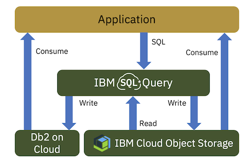

---

copyright:
  years: 2018, 2020
lastupdated: "2020-12-10"

keywords: SQL query, analyze, data, CVS, JSON, ORC, Parquet, Avro, object storage, SELECT, cloud instance, URI, endpoint, api, user roles

subcollection: sql-query

---

{:new_window: target="_blank"}
{:shortdesc: .shortdesc}
{:screen: .screen}
{:codeblock: .codeblock}
{:pre: .pre}

# Overview
{:shortdesc}

{{site.data.keyword.sqlquery_full}} is a fully-managed service that lets you run SQL queries (that is, SELECT statements) to analyze, transform, or clean up rectangular data.
{:shortdesc}

**Note:** You can use {{site.data.keyword.sqlquery_short}} to create SELECT statements only; actions such as CREATE, DELETE, INSERT, and UPDATE are not possible.



Input data is read from CSV, JSON, ORC, Parquet, or AVRO objects located in one or more {{site.data.keyword.cos_full}} instances.
Each query result is written to a CSV, JSON, ORC, Parquet, or AVRO object in a Cloud {{site.data.keyword.cos_short}} instance of your choice.
Use the {{site.data.keyword.sqlquery_short}} user interface (UI) to develop your queries and the
[SQL Query REST API](#restapi) to automate them.

<br>

<iframe width="640" height="390" title="IBM Cloud SQL Query: Provision the IBM Cloud Services"  
src="https://www.youtube.com/embed/_fMEyqRC__c?list=PLzpeuWUENMK2R9CqhF0eJDSxfPBi6JeXA" 
frameborder="0" allow="accelerometer; autoplay; encrypted-media; gyroscope; picture-in-picture" allowfullscreen webkitallowfullscreen mozallowfullscreen></iframe>

*Video 1. {{site.data.keyword.sqlquery_short}}: Provision the IBM Cloud Services*


## Where your input data and query results are stored
{: #stored}

Before you can use the {{site.data.keyword.sqlquery_short}} service to run SQL queries, the input data must be uploaded to one or more Cloud {{site.data.keyword.cos_short}} instances.
You must also have at least 'Writer' access to at least one Cloud {{site.data.keyword.cos_short}} bucket, so that result objects
(that is, the objects containing output data) can be written there.
For more information about Cloud {{site.data.keyword.cos_short}}, including how to provision an instance, create buckets, and upload data, refer to the [Cloud Object Storage Getting Started Guide](/docs/services/cloud-object-storage/getting-started.html#getting-started-console).

## Running a query
{: #running}

Watch the following video to learn more about {{site.data.keyword.sqlquery_short}} and how you can get started to run a basic query.

<iframe width="640" height="390" title="IBM Cloud SQL Query: Run Queries from the Console"  src="https://www.youtube.com/embed/PZAaWSzwo7s?list=PLzpeuWUENMK2R9CqhF0eJDSxfPBi6JeXA" frameborder="0" allow="accelerometer; autoplay; encrypted-media; gyroscope; picture-in-picture" allowfullscreen webkitallowfullscreen mozallowfullscreen></iframe>

*Video 2. {{site.data.keyword.sqlquery_short}}: Run queries from the console*


In SQL, the term *query* is just another way of saying *SELECT statement*. To run a query:

1. In the SQL editor field of the {{site.data.keyword.sqlquery_short}} UI, enter a SELECT statement. In this statement:
    - After the FROM keyword, specify one or more [unique resource identifiers](#table-unique-resource-identifier) (URIs).
Each URI can be thought of as a table. It specifies one or more input objects; each input object can be thought of as a table partition.
You must have at least 'Reader' access to the buckets that contain the input objects.
    - If the format of the input objects is CSV, and no special options are required, there is no need to specify a `STORED AS` clause.
However, if the format is JSON, ORC, Parquet, or AVRO, after the `FROM` clause, specify STORED AS JSON, STORED AS ORC, STORED AS PARQUET, or STORED AS AVRO, as appropriate.
    - If text formats, such as JSON and CSV, are compressed with either gzip or bzip2 and have the extensions *.gz and *.bz, they automatically get recognized as compressed files. However, it is not recommended to use these kinds of compressed files due to performance reasons.
    - If the format of the input objects is CSV and a delimiter other than the default `,` (comma) is used, you have to specify the delimiter using the `FIELDS TERMINATED BY` option of the [`STORED AS`](/docs/services/sql-query?topic=sql-query-sql-reference#externalTableSpec) clause. All single Unicode characters are allowed as delimiters.
    - By default, it is assumed that CSV input objects have a header line that specifies the names of the input columns.  If the objects don't have a header line, you have to specify `NOHEADER` in the [`STORED AS`](/docs/services/sql-query?topic=sql-query-sql-reference#externalTableSpec) clause.
    - By default, it is assumed that JSON input objects consist of a single JSON record per line. If individual records span multiple lines, you have to specify `MULTILINE` in the [`STORED AS`](/docs/services/sql-query?topic=sql-query-sql-reference#externalTableSpec) clause.
    - If required, you can use JOIN constructs to join data from several input URIs, even if those URIs point to different instances of Cloud {{site.data.keyword.cos_short}} .
    - Use the `INTO` clause of a [query](/docs/services/sql-query?topic=sql-query-sql-reference#chapterSQLQueryStatement) to specify the output [URI](#table-unique-resource-identifier), that is, the location to which the result is to be written and the desired result format.
2. Below the query editor, the **Target location** field displays where the result will be stored. An initial bucket in one of your {{site.data.keyword.cos_short}} instances is automatically created for you when you open the UI. It is then chosen as your default location, if your query does not specify an `INTO` clause. To ensure the automatic setup of an initial bucket, the following has to be done in advance:

    - You must have created a {{site.data.keyword.cos_short}} instance.
    - You must have at least 'Writer' access to the corresponding {{site.data.keyword.cos_short}} bucket.

In the *Details* tab of the selected job, you can set any location that you specified in the `INTO` clause as your default location.

3. Click the **Run** button.
When the query completes, a preview of the query result is displayed in the query result tab of the UI. Preview functionality is only available for CSV and JSON result formats. You can run up to five queries simultaneously with a Standard plan instance of {{site.data.keyword.sqlquery_short}}.

### Sample queries
{: #sample}

What does a typical query look like? The following sample queries give you an idea to get you started:

#### Example of a table exploration query
{: #exploration}

The following query selects all columns of a table and limits the result to 50 rows.
Use it to explore a particular table.

```sql
SELECT *
FROM cos://us-geo/sql/customers.csv STORED AS CSV
ORDER BY CustomerID
LIMIT 50
```

#### Example of an exact target path specification
{: #path}

The following query writes an SQL result into an exact result path.
Normally, SQL query always appends jobid=<jobid> to the provided target path to ensure a unique result location with each query execution.
In the following sample query, however, this suffix is eliminated by adding JOBPREFIX NONE to the path in the INTO clause.
Note: This overwrites all objects currently stored in the provided result path.

```sql
SELECT *
FROM cos://us-geo/sql/employees.parquet STORED AS PARQUET
INTO cos://us-south/sql-7fb0b44d-2d76-4c5c-af1e-c746c84f9da1/result/employees.csv JOBPREFIX NONE
```

#### Example of a self join
{: #self-join}

The following query uses a simple self join to list the employees that are located in the same city as Steven.

```sql
SELECT e1.firstname employee, e2.firstname colleague, e1.city
FROM cos://us-geo/sql/employees.parquet STORED AS PARQUET e1,
     cos://us-geo/sql/employees.parquet STORED AS PARQUET e2
WHERE e2.city = e1.city
      AND e1.employeeid <> e2.employeeid
      AND e1.firstname = 'Steven'
ORDER BY e1.city , e1.firstname
```

## Table unique resource identifier
{: #unique}

There are different types of table unique resource identifiers, depending on the type of target service used.
You can either specify Cloud {{site.data.keyword.cos_short}} locations or database locations.
The latter is currently only supported for target locations of an SQL query, and only for {{site.data.keyword.Db2_on_Cloud_long}} and {{site.data.keyword.dashdblong}} database services.

### Cloud Object Storage locations
{: #cos-location}

This identifier points to a location on Cloud {{site.data.keyword.cos_short}} with a URI format. The access to this Cloud {{site.data.keyword.cos_short}} bucket is performed with the {{site.data.keyword.iamlong}} (IAM) identity
of the user that has submitted the SQL statement to {{site.data.keyword.sqlquery_short}}. So, make sure that the user's IAM identity has the necessary access rights granted on the Cloud {{site.data.keyword.cos_short}} bucket.

The identifier has the form:

&nbsp;&nbsp;**`cos://<endpoint>/<bucket>/<path>`**

where:

**`<endpoint>`**
The [endpoint](#endpoints) of your Cloud {{site.data.keyword.cos_short}} instance, or its [alias](#endpoints).

**`<bucket>`**
The bucket name:
- For an input URI, the bucket that contains the input object or objects.
- For an output URI, the bucket to which the output objects are to be written.

**`<path>`**
A more exact specification of the object or objects:
- The specified path is interpreted in a similar way as listing file system contents with `ls`, interpreting slashes `/` in object names as a folder hierarchy.

  - If the path is identical to the name of a an existing (non-empty) object, it only matches that single object.
  - If the path is a prefix of multiple objects at a slash `/` character, it matches all those objects that are not empty. For example, the path `mydir/test1` (or `mydir/test1/`) matches objects `mydir/test1/object1`, `mydir/test1/nested/object2`, but not `mydir/test100`.
  - The usage of a * wildcard depends on how the object structure has been created:
	   - If the object structure has been created as Hive-partitioned structure,
for example as SQL Query result output, and the result objects are starting with the prefix `part-`, wildcards are not supported.
Using SQL constructs based on the Hive structure should always be the preferred method, in order to restrict the number of objects to be read during query processing.
	   - If the object structure has been created as Hive-partitioned structure,
but by using arbitrary file names, the usage of wildcards is supported.
The wildcard matches all objects with the given path prefix. For example, `mydir/test1*`, matches
objects `mydir/test100`, and `mydir/test101/nested/object`.

- For an output URI, this is the prefix under which the [result objects](#result) are to be written.

### Composite input tables
{: compositeInput}

As noted above, the URI for an input table on Cloud {{site.data.keyword.cos_short}} can match multiple objects, forming a "composite" input table. When you run a query over composite input, ensure that the schema of each matching object is appropriate within the context of the SELECT statement. The schemas of the objects don't have to be identical; depending on the input format, the schemas of multiple objects can be merged:
- For CSV format, columns are matched based on their *order*. Some input objects can contain more columns than others, but common columns must always use the same order across objects. The number of columns in the composite input is the maximum number of columns from all matched objects.
- For JSON and Parquet format, columns are matched based on their *name*. The set of columns in the composite input is the union of all column names from matched objects. For Parquet format, you need to use the `MERGE SCHEMA` option of the [`STORED AS`](/docs/services/sql-query?topic=sql-query-sql-reference#externalTableSpec) clause to indicate that schema merging should be performed.
- Input schema merging is not supported for AVRO and ORC formats. The first object determines the set of columns in the composite input, all columns that do not occur in the first object are ignored. The same behavior applies to Parquet, if the `MERGE SCHEMA` option is not specified.

Matching columns need to have compatible data types across all objects where they appear. If a column does not appear in some of the input objects, it is padded with NULL values in the composite input.

### Database locations
{: #db-location}

There are two ways to specify database locations, CRN URIs, and Db2 table URIs. Which one you choose
depends on the target database plan and the access you have to that database.
Note that the number of parallel Db2 connections has an effect on performance. The more parallel connections there are, the better the performance gets, depending on the allowed connections to Db2 and the current free resources of {{site.data.keyword.sqlquery_short}}. Check how many connections your [Db2 plan](https://cloud.ibm.com/catalog/services/db2) allows. 

#### CRN URI location
{: #crn-uri}

If the {{site.data.keyword.Db2_on_Cloud_short}} instance is in an {{site.data.keyword.Bluemix_notm}} account that is accessible to the SQL user, and if the SQL user can see the credentials for that instance (this requires the Operator privilege), then the user can specify the database location using its instance CRN. The access to the database is performed with the user name and password found in the service credentials for this Db2 instance. Note that newly created Db2 instances don't have any service credentials; to create them, select the instance in the {{site.data.keyword.Bluemix_notm}} console and choose **Service credentials** > **New credential**.

You can optionally override the user name and password in the credentials with a custom user and password or a custom API key. Store the password or key into {{site.data.keyword.keymanagementservicefull}} and specify an [access secret clause](/docs/services/sql-query?topic=sql-query-sql-reference#accessSecrets) in your query. Refer to the [security documentation](/docs/services/sql-query?topic=sql-query-security#accessauthentication) for further details.

This option is typically used with Db2 Lite plans, which provide restricted access for a single user in a shared database. It can also be used with Standard plans, but the service credentials for Standard plans always allow full administrator access. If the SQL user should have only restricted access to the target database, use the subsequent "Db2 table URI location" option.

The CRN table has the form:

**`<db service crn>/<table name>`**

You can retrieve the **`<db service crn>`** by opening the resource list in the {{site.data.keyword.Bluemix_notm}} dashboard. Scroll down to the database service instance and click in any of the columns other than the first column. This opens an overlay pane to the right where you find a field labelled `CRN:` with the value and an option to copy it to your clipboard.

The **`<table name>`** part specifies the table that will be created in your database. It has the format **`<schemaname>.<tablename>`**.
If you omit the **`<schemaname>`** part, the table is created in the schema of the `"username"` in the credentials of your database service instance &ndash; for a Db2 Lite plan, this is the only schema that you have access to.
The table name is case-preserving, so use upper case to match database defaults.

An example for a CRN table is: `crn:v1:bluemix:public:dashdb-for-transactions:us-south:s/c3882b7e-00c4-4e7c-a63b-cded1c298f25:23eb50c5-723d-41e0-b7d8-603feaa79ccc:cf-service-instance:/RWS46052.QUERY_RESULT`

#### Db2 table URI location
{: #db2-table-uri}

If the SQL user cannot access the service credentials for the {{site.data.keyword.Db2_on_Cloud_short}} instance (because the user does not have access to the account containing the database instance, or hasn't been granted Operator privilege on the instance), that user can specify the database location using a URI with the Db2 database host name.

By default the access to this database will be performed with the IAM identity of the user who submitted the query. This default requires that the database is enabled for IAM authentication. Also, before using this option, make sure that the IBMid of the user hase been added as a database user. For more information, see section "Console User Experience" in the "User management" documentation of the [Db2 Knowledge Center](https://www.ibm.com/support/knowledgecenter/en/SS6NHC/com.ibm.swg.im.dashdb.security.doc/doc/iam.html). This option is not available for Db2 Lite plans because they don't support IAM authentication in the database.

If you cannot or do not want to use the default mechanism of IAM user authentication, you can instead specify a custom user and password or a custom API key. To do so, store the password or key into {{site.data.keyword.keymanagementservicefull}} and specify an [access secret clause](/docs/services/sql-query?topic=sql-query-sql-reference#accessSecrets) in your query. Refer to the [security documentation](/docs/services/sql-query?topic=sql-query-security#accessauthentication) for further details. This option lets you connect to *any* Db2 database that is accessible from the IBM public cloud network

The Db2 table URI has the form:

**`db2://<db2 host name>/<table name>`**

The **`<db2 host name>`** is the host name of the Db2 instance that is used to access the Db2 Web console and is also used for Java database connectivity (JDBC).

The **`<table name>`** part specifies the table that will be created in your database. It has the format **`<schemaname>.<tablename>`**.
If you omit the **`<schemaname>`** part, the table is created in the schema of database user that has been created for the IBMid of the SQL user.
The table name is case-preserving, so use upper case to match database defaults.

An example for a Db2 table URI is: `db2://db2w-vqplkwx.us-south.db2w.cloud.ibm.com/MYSCHEMA.QUERY_RESULT`

## Object result set
{: #result}

By default, three objects are written to Cloud {{site.data.keyword.cos_short}} as a result set per job:

1. `<target>/jobid=<job_id>`
2. `<target>/jobid=<job_id>/_SUCCESS`
3. `<target>/jobid=<job_id>/<part-number>`

Only the last object contains the result set, the other two are empty and don't contain any data. It is important not to delete any of the objects if you want to use the result set for subsequent queries. By default, the object names will include the job ID. For example, if you specify `mydir/out` or `mydir/out/` as the target directory, the result objects are written under `mydir/out/jobid=<job_id>`. Consequently, when a query is run multiple times, the result set is not overwritten. You can change this behavior with the [`JOBPREFIX`](/docs/services/sql-query?topic=sql-query-sql-reference#cosResultClause) option of the `INTO` clause.

Note that you can use the result set from one query as input data for further SQL queries.
If you want to specify a result of a single query execution as input in your SQL query, specify the first (`<target>/jobid=<job_id>`) or the third one (`<target>/jobid=<job_id>/<part-number>`). You can also use the [partitioning clause](/docs/services/sql-query?topic=sql-query-sql-reference#partitionedClause) to split the result set into multiple objects. Either the entire result set or individual objects can then serve as input for further queries.

A query can even process the output of multiple previous query executions by omitting the `jobid=<job_id>` part in the object name. For example, you can run some setup queries writing to `cos://us-geo/my-bucket/tempstore`, where each query creates new objects inside that prefix with a distinct `jobid=<job_id>` name. You can then run an aggregate query over all of the setup results using `cos://us-geo/my-bucket/tempstore` as a [composite input table](#compositeInput). The aggregate query can treat `jobid` as if it were a column in the input table (for example, in a WHERE clause). This is the Hive-style partitioning concept that Hadoop SQL engines employ for data stored in Hadoop Distributed File System (HDFS).

If you want to run a query over the combined results of multiple previous queries, ensure that these have compatible outputs, so that their schemas can be merged. See the section on [composite input tables](#compositeInput) for detailed information. To make this work properly for CSV format, all setup queries must use the same column names and sequence in their `SELECT` clause, so the results have compatible schemas. If you later need to introduce new columns in additional setup queries, add these to the end of the column list. If this is not the case, the structure of the composite `tempstore` data set gets corrupted, causing unreadable objects, corrupted data, or unreliable results.

## Endpoints
{: #endpoints}

Your Cloud {{site.data.keyword.cos_short}} instance will have one of the supported endpoints. {{site.data.keyword.sqlquery_short}} supports all 
[public and private {{site.data.keyword.cos_short}} endpoints](https://cloud.ibm.com/docs/services/cloud-object-storage?topic=cloud-object-storage-endpoints).
To save space, you can use the alias shown instead of the full endpoint name. 

Aliases to tethering endpoints (specific endpoints within cross region domains, for example, `dal-us-geo`) are considered legacy. They continue to work until further notice but will be deprecated sometime in the future. To be prepared, update your applications to use the alias of the corresponding cross region endpoint (for example, `us-geo`).

**Note:** {{site.data.keyword.sqlquery_short}} will always use the internal endpoint to interact with {{site.data.keyword.cos_short}}, 
even if an external endpoint has been specified in the query. The result location for a query will always indicate the external endpoint name.
When interacting with {{site.data.keyword.sqlquery_short}} programmatically through the API, you can use the internal endpoint name to read results 
instead of the external endpoint name that is returned by the API.

The following tables list some examples of currently supported {{site.data.keyword.sqlquery_short}} endpoints:


Cross Region Endpoint Name | Alias
--- | ---
s3.us.cloud-object-storage.appdomain.cloud     | us-geo
s3.eu.cloud-object-storage.appdomain.cloud     | eu-geo
s3.ap.cloud-object-storage.appdomain.cloud     | ap-geo

Regional Endpoint Name | Alias
--- | ---
s3.eu-de.cloud-object-storage.appdomain.cloud    | eu-de
s3.eu-gb.cloud-object-storage.appdomain.cloud    | eu-gb
s3.us-south.cloud-object-storage.appdomain.cloud | us-south
s3.us-east.cloud-object-storage.appdomain.cloud  | us-east
s3.au-syd.cloud-object-storage.appdomain.cloud   | au-syd
s3.jp-tok.cloud-object-storage.appdomain.cloud   | jp-tok

Single Data Center Endpoint Name | Alias
--- | ---
s3.ams03.cloud-object-storage.appdomain.cloud   | ams03
s3.che01.cloud-object-storage.appdomain.cloud   | che01
s3.tor01.cloud-object-storage.appdomain.cloud   | tor01
s3.osl01.cloud-object-storage.appdomain.cloud   | osl01
s3.mel01.cloud-object-storage.appdomain.cloud   | mel01
s3.sao01.cloud-object-storage.appdomain.cloud   | sao01
s3.hkg02.cloud-object-storage.appdomain.cloud   | hkg02
s3.mex01.cloud-object-storage.appdomain.cloud   | mex01
s3.mil01.cloud-object-storage.appdomain.cloud   | mil01
s3.mon01.cloud-object-storage.appdomain.cloud   | mon01
s3.par01.cloud-object-storage.appdomain.cloud   | par01
s3.sjc04.cloud-object-storage.appdomain.cloud   | sjc04
s3.seo01.cloud-object-storage.appdomain.cloud   | seo01
s3.sng01.cloud-object-storage.appdomain.cloud   | sng01

## Availability zones
{: #availability}

Regions | Availability zones
--- | ---
Dallas  | 3
Frankfurt | 3
Chennai | 1

For Availability Service Level Agreements please refer to the [Cloud Service terms](http://www-03.ibm.com/software/sla/sladb.nsf/sla/bm?OpenDocument).

## Programmatic access
{: #access}

### REST API
{: #restapi}

You can use the [SQL Query service REST API](https://cloud.ibm.com/apidocs/sql-query)
to run queries and retrieve information about their status. This is especially helpful when writing code that automatically queries data.

**Note:** The Cloud Resource Name (CRN) is a mandatory part of an {{site.data.keyword.sqlquery_short}} REST endpoint call. The CRN Copy button copies your CRN to clipboard and you can just paste it into your API call.

### Python applications and notebooks
{: #python}

For a Python application, you can also use the [ibmcloudsql package](https://pypi.org/project/ibmcloudsql/).
This allows you to use IBM Watson Studio to run queries with {{site.data.keyword.sqlquery_short}} and visualize the query results with one of the various widget libraries available in [Watson Studio](https://cloud.ibm.com/catalog/services/data-science-experience).

Using the ibmcloudsql library, you can also interact with {{site.data.keyword.sqlquery_short}} directly from Watson Studio notebooks.
You can start by [Using IBM Cloud SQL Query notebook](https://dataplatform.ibm.com/analytics/notebooks/v2/656c7d43-7ccd-4e50-a3c0-bbc37c001132/view?access_token=baaa77ad715e17a8f823615d45431329fde0fe92fecb85abb9fc55a877939fe8)
in the [Watson Studio community](https://dataplatform.ibm.com/exchange/public/entry/view/4a9bb1c816fb1e0f31fec5d580e4e14d).

### Cloud functions
{: #cloud}

{{site.data.keyword.sqlquery_short}} is a serverless mechanism to submit SQL queries, making it a very natural match for the serverless
[IBM Cloud Functions](https://www.ibm.com/cloud/functions). Accordingly, you can use the generic
[SQL Cloud function](https://hub.docker.com/r/ibmfunctions/sqlquery) to run {{site.data.keyword.sqlquery_short}} as an IBM Cloud function.

### Geospatial functions
{: #geospatial-functions}

The [Geospatial Toolkit](https://www.ibm.com/support/knowledgecenter/en/SSCJDQ/com.ibm.swg.im.dashdb.analytics.doc/doc/geo_intro.html)
provides a set of [geospatial functions](https://www.ibm.com/support/knowledgecenter/en/SSCJDQ/com.ibm.swg.im.dashdb.analytics.doc/doc/geo_functions.html)
that you can use to efficiently process and index spatial data.
These functions are integrated into the {{site.data.keyword.sqlquery_short}} service and ready for immediate use.
The {{site.data.keyword.sqlquery_short}} service also provides several sample queries that illustrate how
to use these functions.

## Required user roles
{: #user-roles}

The following table shows which user roles are required to invoke a particular service action or API endpoint.
Use this information to decide which access rights to grant your users when creating new user IDs.

Description | Service Action | API Endpoint | Required User Roles
--- | --- | --- | ---
Submit an SQL query | sql-query.api.submit | POST/v2/sql_jobs/ | Manager or Writer
Get info for all submitted jobs | sql-query.api.getalljobs | GET/v2/sql_jobs/ | Manager, Writer, or Reader
Get info for a specific submitted job | sql-query.api.getjobinfo | GET/v2/sql_jobs/{job_id} | Manager, Writer, or Reader
Submit a catalog or index management statement | sql-query.api.managecatalog | POST/v2/sql_jobs/ | Manager

## Data scanned behavior
{: #data-scanned}

{{site.data.keyword.sqlquery_short}} reads as little data as possible based on your query. The amount of data scanned depends on the amount of data that {{site.data.keyword.sqlquery_short}} has to read to execute your query, and not on the actual size of your data. Several factors play a role when it comes to how much data needs to be accessed to execute a query. First, data layout is very important. Columnar formats, such as Parquet, lead to less data scanned, as {{site.data.keyword.sqlquery_short}} can selectively read ranges and single columns. Furthermore, the actual object layout determines how many objects need to be scanned. Read [How to layout big data in IBM Cloud Object Storage for Spark SQL](https://www.ibm.com/cloud/blog/big-data-layout) for more details on how to lay out big data on Cloud {{site.data.keyword.cos_short}} to improve cost and performance of SQL queries.

Each successful query is charged with at least 10MB.

### Example:
{: #data-scanned-example}

Let's assume you have 1 PB of data stored on Cloud {{site.data.keyword.cos_short}} that is laid out as described in the 
[blog post](https://www.ibm.com/cloud/blog/big-data-layout) and is optimized for the queries you want to execute. 
If you run a single query, the most expensive query possible is `SELECT * FROM`, as reading 1 PB of data is essentially required. Any other query will be much cheaper and faster. For example, a 1 PB data set consists of audit events for users of a system (user A performed action B in system X at time T) and the data is laid out in a way that it is partitioned by time (one file per day and system). So to answer a query like `SELECT DISTINCT user FROM WHERE System='X' AND Day >= (TODAY - 30)`, {{site.data.keyword.sqlquery_short}} has to access all objects for system X that contain data for the last 30 days. The sum of the size of these objects is the upper bound estimate of data scanned you would be charged for. But as {{site.data.keyword.sqlquery_short}} only accesses one field, and data is stored as Parquet, it is actually much less. Calculating the precise price of the query is not possible in advance, because much of it depends on the data itself. Parquet, for example, stores compressed columns, so if the column can be compressed effectively, even less data needs to be read. You also find some further details in the blog post [SQL Query releases serverless transformation and partitioning of data in open formats](https://www.ibm.com/cloud/blog/announcements/sql-query-releases-serverless-transformation-and-partitioning-of-data-in-open-formats) about {{site.data.keyword.sqlquery_short}} ETL capabilities and how they affect data scanned.

## Timestamps
{: #timestamps}

Values of the **timestamp** data type are created with UTC timezone by default. So, for instance, the expressions `timestamp('2009-07-30 04:17:52')`, `to_timestamp('2016-12-31', 'yyyy-MM-dd')` or `current_timestamp` will all result in a UTC timestamp value and the input string expressions are assumed to be in UTC time.

If you want to create a UTC timestamp from a string expression that represents a different timezone, use [`to_utc_timestamp`](/docs/sql-query?topic=sql-query-sqlfunctions#to_utc_timestamp), as in `to_utc_timestamp('2016-08-31', 'Asia/Seoul')`.

You can also create timestamp values in a different timezone from a UTC timestamp value, or a UTC string expression using [`from_utc_timestamp`](/docs/sql-query?topic=sql-query-sqlfunctions#from_utc_timestamp), as in `from_utc_timestamp(current_timestamp, 'Asia/Seoul')` or `from_utc_timestamp('2016-08-31', 'Asia/Seoul')`.

## Limitations
{: #limitations}

- If a JSON, ORC, or Parquet object contains a nested or arrayed structure, a query with CSV output using a wildcard (for example, `SELECT * from cos://...`) returns an error such as "Invalid CSV data type used: `struct<nested JSON object>`."
Use one of the following workarounds:
  - For a nested structure, use the [`FLATTEN`](/docs/services/sql-query?topic=sql-query-sql-reference#tableTransformer) table transformation function. Alternatively, you can specify the fully nested column names instead of the wildcard, for example, `SELECT address.city, address.street, ... from cos://...`.
  - For an array, use the Spark SQL explode() function, for example, `select explode(contact_names) from cos://...`.

- If you receive a corrupted result, verify that the source URI is correct and that the correct input format is specified using 'STORED AS' in the SQL statement.

- If you receive an error message stating that some columns are not found in the input columns, but the columns do exist in the input, check if the input format being specified using 'STORED AS' in the SQL statement is the actual format of your input.

- In order to process CSV input with {{site.data.keyword.sqlquery_short}}, each row has to be contained within one line. Multi-line values are not supported.

  If you use {{site.data.keyword.sqlquery_short}} to generate CSV results from other data formats like Parquet that support newlines within values and these CSV results should be queried again, newlines must explicitly be removed before writing the results. To do so, use the SQL function `regexp_replace`. For example, a Parquet object `data` has an attribute `multi_line` containing values spanning multiple lines. To select a subset of rows based on a `condition` and store it on Cloud {{site.data.keyword.cos_short}} for further processing, a skeleton SQL statement looks like the following:

	`SELECT regexp_replace(multi_line, '[\\r\\n]', ' ') as multi_line FROM data STORED AS parquet WHERE condition`
