---

copyright:
  years: 2018, 2020
lastupdated: "2020-02-19"

---

{:new_window: target="_blank"}
{:shortdesc: .shortdesc}
{:screen: .screen}
{:codeblock: .codeblock}
{:pre: .pre}

# SQL reference

## Introduction
{: #chapterIntroduction}

{{site.data.keyword.sqlquery_full}} allows you to analyze and transform open data with SQL. It supports the various types of SELECT statements from the ANSI SQL standard.

The SELECT statement (or query statement) is used to read object data from {{site.data.keyword.cos_full}} (COS),
process the data, and store it back on Cloud {{site.data.keyword.cos_short}} eventually.

You can use {{site.data.keyword.sqlquery_short}} as a data transformation service, as it always writes the results of a query to a given location in either {{site.data.keyword.cos_short}} or DB2 tables.
{{site.data.keyword.sqlquery_short}} provides extended SQL syntax inside a special INTO clause to control how the result data is stored physically. This includes control over data location, format, layout, and partitioning.

A query statement can be submitted via {{site.data.keyword.sqlquery_short}}'s web UI or programmatically,
either by using the service's REST API, or by using the Python or Node.JS SDK. You can also use {{site.data.keyword.DSX_full}}
and the Python SDK in order to use {{site.data.keyword.sqlquery_short}} interactively with Jupyter Notebooks. In addition, you can submit SQL queries using {{site.data.keyword.openwhisk}}.

In addition to the ad hoc usage of data in {{site.data.keyword.cos_full}}, you can also register and manage your data in a catalog as tables, consisting of columns and partitions.

There are several benefits to cataloging your data:

1. It simplifies SQL SELECT statements because the SQL author does not have to know and specify exactly where and how the data is stored.
2. The SQL execution can skip the inference of schema and partitioning because this information is already available in the metastore. This can improve you query performance, especially for text-based data formats, such as CSV and JSON, where the schema inference requires a full scan of the data before the actual query execution.
<!-- Hide 3. With the *ANALYZE TABLE* command, you can gather statistics about your data, which is then used by the SQL compiler to do a cost-based optimization of the query plan, which can result in significantly improved query performance for queries on larger data volumes. -->

## Select
{: #chapterSQLQueryStatement}

The general syntax of an SQL query statement is outlined below using the `query` clause and the `namedQuery` clause.

<h3 id="query">query</h3>

<div style="overflow-x : auto;">
<map name="queryImgMap">
	<area alt="section namedQuery" shape="rect" coords="162,30,262,52" href="#namedQuery" />
	<area alt="section fullselect" shape="rect" coords="51,134,151,156" href="#fullselect" />
	<area alt="section intoClause" shape="rect" coords="181,134,281,156" href="#intoClause" />
</map>
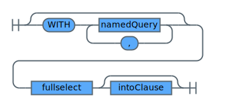
</div>

<h3 id="namedQuery">namedQuery</h3>

<div style="overflow-x : auto;">
<map name="namedQueryImgMap">
	<area alt="section identifier" shape="rect" coords="50,30,150,52" href="#identifier" />
	<area alt="section query" shape="rect" coords="294,30,354,52" href="#query" />
</map>

</div>

<h3 id="intoClause">namedQuery</h3>

<div style="overflow-x : auto;">
<map name="intoClauseImgMap">
	<area alt="section cosResultClause" shape="rect" coords="132,20,272,42" href="#cosResultClause" />
	<area alt="section dbResultClause" shape="rect" coords="136,50,268,72" href="#dbResultClause" />
</map>
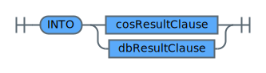
</div>

The query statement supports *common table expressions*. A common table expression permits defining a result table with a table name
that can be specified as a table name in any FROM clause of the fullselect that follows.

Common table expressions are defined by using the reserved keyword `WITH` followed by one or more *named queries*.
Each common table expression specified can also be referenced by name in the FROM clause of subsequent common table expressions.

Creating a common table expression avoids the overhead of creating and dropping an intermediate result object on
Cloud {{site.data.keyword.cos_short}} that is needed only for a certain query.

Moreover, a common table expression is beneficial when the same result table must be shared in a fullselect.

<h3>Examples</h3>

The common table expression examples use values clauses to define tables inline. For more details about the values clause refer to [valuesClause](#valuesClause).

```sql
-- find the department with the highest total pay
WITH dtotal AS (
    SELECT
        col1 AS deptno,
        SUM(col3+col4) AS totalpay
    FROM  VALUES -- deptno, empid, salary, bonus
        (1, 1, 1000, 0), (1, 2, 2000, 500), (1, 3, 3000, 0),
        (2, 4, 5000, 200), (2, 5, 6000, 0), (2, 6, 4000, 0),
        (3, 7, 2000, 500), (3, 8, 2000, 500), (3, 9, 8000, 0)
    GROUP BY col1
)
SELECT deptno
FROM dtotal
WHERE totalpay = (SELECT MAX(totalpay) FROM  dtotal)
```
{: codeblock}

| DEPTNO |
| ------ |
| 2 |
{: caption="Table 1. Query result for example 'find the department with the highest total pay'" caption-side="top"}


```sql
-- list products with a price above the average price
WITH  products AS (
    SELECT
        col1 AS productid,
        col2 AS price
    FROM VALUES -- productid, price
        (1, 10), (2, 20), (3, 30), (4, 40),
        (5, 5), (6, 10), (7, 15), (8, 40),
        (9, 100), (10, 200), (11, 300), (12, 400)
), avg_product_price AS (
    SELECT
        AVG(price) as avg_price
    FROM products
)
SELECT
    productid,
	price,
	(SELECT * FROM avg_product_price) AS avg_price,
	price-(SELECT * FROM avg_product_price) AS price_dist
FROM products WHERE price > (SELECT * FROM avg_product_price)
```
{: codeblock}

| PRODUCTID | PRICE | AVG_PRICE | PRICE_DIST |
| --------- | ----- | --------- | ---------- |
| 9         | 100   |  97.5     | 2.5        |
| 10        | 200   |  97.5     | 102.5      |
| 11        | 300   |  97.5     | 202.5      |
| 12        | 400   |  97.5     | 302.5      |
{: caption="Table 2. Query result for example 'list products with a price above the average price'" caption-side="top"}


<h3 id="cosResultClause">cosResultClause</h3>

You can use the Cloud {{site.data.keyword.cos_short}} result clause to apply detailed control over the location, format and layout of the SQL query result set being stored on Cloud {{site.data.keyword.cos_short}}.

The default is `JOBPREFIX JOBID`, which means that `jobid=` is always appended to the target prefix.
You can optionally specify `JOBID NONE`, which skips the appending of `jobid=`. This means that the results are written
exactly to the requested path. However, if that path contains existing objects (for example, from a previous query execution with the same target path),
all existing objects get removed when the new result objects are written.

A query cannot run if `JOBPREFIX NONE` is specified and the target overlaps with at least one of the input URIs.
The reason is that data cannot be overwritten by a query that is reading that same data.
For example, `SELECT * FROM cos://us-geo/mybucket/myprefix/mysubprefix INTO cos://us-geo/mybucket/myprefix JOBPREFIX NONE`
will return an error when trying to submit it.

The *COS result clause* lets you explicitly specify the storage location and type of a query result on Cloud {{site.data.keyword.cos_short}}.
The storage location is specified by means of a `COSURI`.

Valid query result object types are: `AVRO`, `CSV`, `JSON`, `ORC`, or `PARQUET`. Note that object type names are not case sensitive.

Being able to explicitly specify the location and the type of the result object enables a user to take the following actions:
* Read *raw* data stored in one format, for example, CSV
* Cleanse the data using SQL constructs
* Store the cleansed data using an object type that offers benefits with respect to query performance and storage consumption on Cloud {{site.data.keyword.cos_short}}, for example, a column based object format like Parquet

Moreover, a user can explicitly define the way a query result is stored physically on Cloud {{site.data.keyword.cos_short}} by using the *result partitioned clause*.

As shown in the syntax diagrams, there are three main use cases to define the physical layout of a query's result on Cloud {{site.data.keyword.cos_short}}:

1. Partition by columns, that is so-called Hive-style partitioning.
2. Partition into buckets/objects (both terms can be used synonymously), that is, generate the query result into objects, with or without specifying columns.
3. Partition by number of rows.

A partition is an object on Cloud {{site.data.keyword.cos_short}} that is potentially a part of an aggregated object.
The presence of multiple partitions allows for parallel input/output (I/O) during query execution. Note that if no *result partitioned clause* is specified,
the query result is stored in a single partition on Cloud {{site.data.keyword.cos_short}}.

<div style="overflow-x : auto;">
<map name="cosResultClauseImgMap">
	<area alt="section COSURI" shape="rect" coords="50,30,118,52" href="#COSURI" />
	<area alt="section partitionedClause" shape="rect" coords="377,134,533,156" href="#partitionedClause" />
	<area alt="section sortClause" shape="rect" coords="573,134,673,156" href="#sortClause" />
</map>

</div>

<h3 id="partitionedClause">partitionedClause</h3>

You can use the result partitioned clause to control the layout of the SQL query result set being stored. The default behavior is to store the result into one single partition, that is a single object in Cloud {{site.data.keyword.cos_short}}.

<div style="overflow-x : auto;">
<map name="partitionedClauseImgMap">
	<area alt="section identifier" shape="rect" coords="322,30,422,52" href="#identifier" />
	<area alt="section unsignedInteger" shape="rect" coords="143,134,283,156" href="#unsignedInteger" />
	<area alt="section unsignedInteger" shape="rect" coords="151,238,291,260" href="#unsignedInteger" />
</map>

</div>

<h3 id="sortClause">sortClause</h3>

This clause can be used to sort in many ways. When specified in combination with PARTITIONED BY, it sorts the rows within each partition
by the sort order specified in the SORT BY clause. When specified in combination with PARTITIONED INTO, the same is done,
which is often referred to as clustering the rows by the specified columns into the fixed number of partitions specified by PARTITIONED INTO.
When specified without the PARTITIONED clause, it is equivalent to an ORDER BY clause specified at the top level of the SQL SELECT statement.
The ORDER BY clause will be ignored, as soon PARTITIONED INTO is specified.

<div style="overflow-x : auto;">
<map name="sortClauseImgMap">
	<area alt="section expression" shape="rect" coords="246,30,346,52" href="#expression" />
</map>
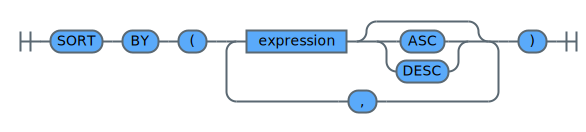
</div>


<h4>Partition by columns</h4>

Using the `PARTITIONED BY (column-list)` clause without specifying `INTO x BUCKETS/OBJECTS` lets you store the query result
using Hive-style partitioning, that is, to create partitions that contain only rows having certain values for one or more columns.
This physical layout should be chosen in case the stored object is further analyzed using SQL queries that specify predicates on the partition columns.

For example, a result object containing world-wide order data has a column `country` representing the country the order has been initiated from.
Partitioning the result object by the column `PARTITIONED BY (country)`, would create a result object with a partition for each country present in the query result.

Once the result object is stored this way on Cloud {{site.data.keyword.cos_short}}, each SQL query containing a predicate,
such as `country = 'USA'` or `country in ('MALTA', 'ITALY', 'VATICAN CITY')`, benefits from this physical layout. The reason is that during
SQL query execution only partitions containing data for the countries of interest have to be read. This tremendously cuts down the I/O traffic of the SQL query.

Some additional remarks on Hive-style partitioning:

1. Hive-style partitions have an eye-catching naming scheme, because the column names used for partitioning are part of the partition object prefix, for example, `/order/COUNTRY=USA/part-m-00000.snappy.parquet`.
2. Hive-style partitions do not contain any values for partition columns since their values are *stored* in the object prefix of the partition.
Thus, note that if you copy a HIVE-style partition and rename the object prefix by removing the partition column values, you are loosing data.
3. Hive-style partitions can have a tendency for data skewing, for example, the partition representing order data from Malta is very likely much smaller
than the partition representing order data from the USA. You can partition the query result into separate objects if you want to have *equally-sized* partitions.


<h4>Partition by columns into objects</h4>

Partitioning a query result into objects lets you specify the exact number of *equally-sized* result partitions. This lets you experimentally fine tune the number of objects to meet certain criteria for partition size. To specify the number of partitions, use the `PARTITIONED INTO x BUCKETS/OBJECTS` clause.

For example, knowing the size of the query result, it is possible to calculate the number of objects to end up with partitions having a certain size, for example, 128 MB, that is the HADOOP default file size, or any other size that meets application requirements.

The `INTO x BUCKETS/OBJECTS` clause can be combined with the `BY (column-list)` clause to create a certain number of partitions that support data affinity with respect to specified partition columns.

Continue with the example above specifying `PARTITION BY (customerid) INTO 10 OBJECTS` stores the query result into 10 objects ensuring that all data for a customer
is stored in the same partition. Note that although it is ensured that all data for a certain customer is stored in the same partition,
it is not ensured that the data is sorted physically according to the specified column.

<h4>Partition by number of rows</h4>

Partitioning by number of rows lets you specify the number of rows that go into a single partition. To specify the number of rows stored in each partition,
use the `EVERY x ROWS` clause. In case the row length of the result object is not varying heavily, the *partition every rows* clause also lets you create *almost equally-sized* result partitions.

Using the `PARTITIONED EVERY x ROWS` clause on a sorted query result ensures that partitions are created having a certain number of rows that are sorted according to the query's `SORT BY` clause. This physical layout can be useful to create partitions that are processed by an application in a pagination manner, for example, browsing order data sorted by *order date* and *customer id*.

Note that using `PARTITIONED EVERY x ROWS` clause causes data to be written single-threaded to Cloud {{site.data.keyword.cos_short}}, that is no parallel I/O is performed to write query results to Cloud {{site.data.keyword.cos_short}}.

<h3 id="dbResultClause">dbResultClause</h3>

You can use the Db result clause to specify that query results should be stored as a relational database table in {{site.data.keyword.Bluemix_notm}}.
Currently, {{site.data.keyword.Db2_on_Cloud_long}} is the only supported target database.

Storing query results in a database will create a new table with the columns determined by the query result. When writing to Db2,
the following type mapping rules apply:
 * String types are mapped to VARCHAR(32000) columns.
 * Struct types are not mapped and have to be flattened first. See the `FLATTEN` [table transformation function](#tableTransformer).
 * Arrays, timeseries, and spatial data types are not mapped and have to be converted with appropriate SQL functions.

The table name and optional schema are specified as part of the target URI.
**Important**: If a table with the given name already exists in the target database, that table is dropped before the query executes
and all existing data is deleted.

You can use the `PARALLELISM x` clause to specify that multiple parallel database connections should be opened to write out
the result. Depending on the size of your result and the network connectivity of your target database service,
this can reduce the query processing time significantly.

<div style="overflow-x : auto;">
<map name="dbResultClauseImgMap">
	<area alt="section CRN_URI" shape="rect" coords="84,40,160,62" href="#CRN_URI" />
	<area alt="section DB2_TABLE_URI" shape="rect" coords="60,70,184,92" href="#DB2_TABLE_URI" />
	<area alt="section unsignedInteger" shape="rect" coords="291,153,431,175" href="#unsignedInteger" />
	<area alt="section accessSecrets" shape="rect" coords="61,227,185,249" href="#accessSecrets" />
</map>
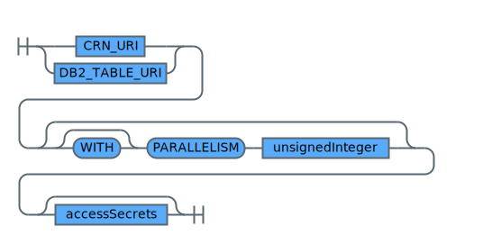
</div>

<h3 id="accessSecrets">accessSecrets</h3>

By default, either the credentials needed to access the target database are taken from the credentials object of a `CRN_URI`, or the IAM user
submitting the statement is used to connect to the `DB2_TABLE_URI`.
You can override this default by specifying either  a combination of `USER` and `PASSWORD` or an `APIKEY`. However, the password or API key is **not** included in the SQL statement as plain text. Instead, you must to store it as a custom key in a {{site.data.keyword.keymanagementservicefull}} instance to which you have access.
For a description how to store and manage the secrets in {{site.data.keyword.keymanagementserviceshort}}, see [Setting up custom secrets in Key Protect](/docs/services/sql-query?topic=sql-query-security#kpsetup).

<div style="overflow-x : auto;">
<map name="accessSecretsImgMap">
	<area alt="section identifier" shape="rect" coords="142,20,242,42" href="#identifier" />
	<area alt="section CRN_URI" shape="rect" coords="366,20,442,42" href="#CRN_URI" />
	<area alt="section CRN_URI" shape="rect" coords="262,50,338,72" href="#CRN_URI" />
</map>
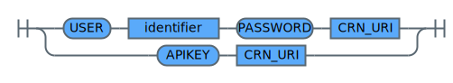
</div>

<h3>More Topics</h3>

For further details about clauses used in a *query*, refer to the following topics:
* [COSURI](#COSURI)
* [CRN_URI](#CRN_URI)
* [DB2_TABLE_URI](#DB2_TABLE_URI)
* [fullselect](#fullselect)
* [identifier](#identifier)
* [namedQuery](#namedQuery)
* [query](#query)

<h3>Related References</h3>

A *query* is referenced by the following clauses:
* [booleanExpression](#booleanExpression)
* [namedQuery](#namedQuery)
* [predicate](#predicate)
* [primaryExpression](#primaryExpression)


### Fullselect Clause
{: #chapterFullSelectClause}

<h3 id="fullselect">fullselect</h3>

A *fullselect* is the core component of a *query*. It is the only mandatory general component for a valid query statement. The other components outside of *fullselect* are optional. Its syntax is defined by the syntax diagram below.

<div style="overflow-x : auto;">
<map name="fullselectImgMap">
	<area alt="section simpleselect" shape="rect" coords="150,30,266,52" href="#simpleselect" />
	<area alt="section fullselect" shape="rect" coords="158,60,258,82" href="#fullselect" />
	<area alt="section valuesClause" shape="rect" coords="150,90,266,112" href="#valuesClause" />
	<area alt="section sortItem" shape="rect" coords="227,294,311,316" href="#sortItem" />
	<area alt="section expression" shape="rect" coords="243,398,343,420" href="#expression" />
	<area alt="section expression" shape="rect" coords="267,502,367,524" href="#expression" />
	<area alt="section sortItem" shape="rect" coords="219,606,303,628" href="#sortItem" />
	<area alt="section namedWindows" shape="rect" coords="61,710,177,732" href="#namedWindows" />
	<area alt="section expression" shape="rect" coords="317,740,417,762" href="#expression" />
</map>

</div>

The result set defined by a single fullselect can be combined with the result set of one or more other fullselects using set operators.

The following set operators are supported and each set operator derives a result set from two other result sets R1 and R2:
* `INTERSECT`:  The result consists of all rows in R1 **and** R2.
* `UNION`: The result consists of all rows in R1 and R2.
* `EXCEPT`: The result consists of all rows that do not have a corresponding row in R2.
* `MINUS`: The minus operator is a synonym for the except operator and is supported for compatibility with other SQL implementations.

These set operators can be further refined by using the following modifiers:
* `DISTINCT`: This modifier ensures that the overall result set does not contain any duplicates. This is the default modifier that applies if no modifier is present.
* `ALL`: All rows of a fullselect's result set are combined using a set operator. Thus, the overall result set can contain duplicates.

Note that the following combination of set operators and set modifiers are not supported:
* `INTERSECT ALL`
* `EXCEPT ALL`
* `MINUS ALL`

The characteristics of a result set defined by a fullselect can be further defined using the following clauses:
* `ORDER BY`: Define an overall ordering of the result set based on the criteria defined by the list of `sortItem` clauses.
The default order direction is ascending if not explicitly specified by a `sortItem` clause. Note that the *order by* clause
cannot be used in conjunction with *cluster by*, *distribute by* or *sort by* clause.
When you use partitioned output, the `ORDER BY` clause gets ignored. Use the `sortClause` instead.
* `DISTRIBUTE BY`: Distribute result set rows into new partitions based on the criteria defined by the list of `expression` clauses.
Result set rows having the same expression values will be moved to the same partition. Note that the *distribute by* clause cannot be
used in conjunction with *order by* or *cluster by* clause.
* `SORT BY`: The *sort by* clause lets you define an overall ordering on a partition base as defined by the list of `expression` clauses.
The default order direction is ascending if not explicitly specified by an `expression` clause.  The *sort by* clause is used in conjunction
with the *distribute by* clause.
* `CLUSTER BY`: Distribute result set rows into new partitions based on the criteria defined by the list of `expression` clauses. Moreover, each
partition is sorted in ascending order based on the criteria defined by the set of `expression` clauses. Thus, this clause represents a shortcut
for *distribute by* clause combined with *sort by* in ascending order. The *cluster by* attribute cannot be used in conjunction with the *order by*,
*distribute by*, *sort by* clause.
* `LIMIT`: Restrict the number of rows returned from the result set of the fullselect. The number of rows can be defined by an `expression` or using
the keyword `ALL` that causes all rows to be returned.

Note that `DISTRIBUTE BY`, `SORT BY` and `CLUSTER BY` only have an effect during your SQL query execution and do not influence the query result
written back to Cloud {{site.data.keyword.cos_short}}. Use these clauses only in execution of subqueries in order to optimize the outer
query execution that works on the intermediate result sets produced by the sub queries. In order to define the persistent target of the overall query
that is written back to Cloud {{site.data.keyword.cos_short}}, you need to use the dedicated [resultClause](#resultClause) instead.

<h3>Examples</h3>

The set operator examples use values clauses to define result sets for the set operations. For more details about the values clause refer to [valuesClause](#valuesClause).

```sql
-- set union eliminating duplicate rows
SELECT * FROM VALUES 1, 2 ,3 UNION VALUES 1, 2, 3
```
{: codeblock}

```sql
-- set union eliminating duplicate rows
SELECT * FROM VALUES 1, 2 ,3 UNION DISTINCT VALUES 1, 2, 3
```
{: codeblock}

The result of the example queries is shown in the table below.

| COL1 |
| ---- |
|1     |
|3     |
|2     |
{: caption="Table 3. Query result for example 'set union eliminating duplicate rows'" caption-side="top"}


```sql
-- set union with duplicate rows
SELECT * FROM VALUES 1, 2 ,3 UNION ALL VALUES 1, 2, 3
```
{: codeblock}

The result of the example query is shown in the table below.

|COL1|
|----|
|1   |
|2   |
|3   |
|1   |
|2   |
|3   |
{: caption="Table 4. Query result for example 'set union with duplicate rows'" caption-side="top"}


```sql
-- intersecting set eliminating duplicate rows
SELECT * FROM VALUES 1, 2 ,3 INTERSECT VALUES 2, 2, 3, 3, 3
```
{: codeblock}

```sql
-- intersecting set eliminating duplicate rows
SELECT * FROM VALUES 1, 2 ,3 INTERSECT DISTINCT VALUES 2, 2, 3, 3, 3
```
{: codeblock}

The result of the example queries is shown in the table below.

|COL1|
|----|
|3   |
|2   |
{: caption="Table 5. Query result for example 'intersecting set eliminating duplicate rows'" caption-side="top"}


```sql
-- Difference quantity eliminating duplicate rows
SELECT * FROM VALUES 1, 2 ,3 EXCEPT VALUES 2, 2, 3, 3, 3
```
{: codeblock}

```sql
-- difference quantity eliminating duplicate rows
SELECT * FROM VALUES 1, 2 ,3 EXCEPT DISTINCT VALUES 2, 2, 3, 3, 3
```
{: codeblock}

```sql
-- difference quantity eliminating duplicate rows
SELECT * FROM VALUES 1, 2 ,3 MINUS VALUES 2, 2, 3, 3, 3
```
{: codeblock}

```sql
-- difference quantity eliminating duplicate rows
SELECT * FROM VALUES 1, 2 ,3 MINUS DISTINCT VALUES 2, 2, 3, 3, 3
```
{: codeblock}

The result of the example queries is shown in the table below.

|COL1|
|----|
|1   |
{: caption="Table 6. Query result for example 'difference quantity eliminating duplicate rows'" caption-side="top"}


<h3>More Topics</h3>

For further details about the clauses used in a *fullselect* refer to the following topics:
* [expression](#expression)
* [fullselect](#fullselect)
* [namedWindows](#namedWindows)
* [simpleselect](#simpleselect)
* [sortItem](#sortItem)
* [valuesClause](#valuesClause)

<h3>Related References</h3>

A *fullselect* is referenced by the following clauses
* [fullselect](#fullselect)
* [query](#query)
* [relationPrimary](#relationPrimary)

### Simpleselect Clause
{: #chapterSimpleSelectClause}

A *simpleselect* is a component of a *fullselect*. Its syntax is defined by the syntax diagram below.

<h3 id="simpleselect">simpleselect</h3>

<div style="overflow-x : auto;">
<map name="simpleselectImgMap">
	<area alt="section resultColumn" shape="rect" coords="322,40,438,62" href="#resultColumn" />
	<area alt="section relation" shape="rect" coords="163,153,247,175" href="#relation" />
	<area alt="section lateralView" shape="rect" coords="307,153,415,175" href="#lateralView" />
	<area alt="section booleanExpression" shape="rect" coords="151,257,307,279" href="#booleanExpression" />
	<area alt="section groupByClause" shape="rect" coords="61,331,185,353" href="#groupByClause" />
	<area alt="section booleanExpression" shape="rect" coords="323,331,479,353" href="#booleanExpression" />
	<area alt="section namedWindows" shape="rect" coords="61,405,177,427" href="#namedWindows" />
</map>

</div>

The simpleselect lets you specify the following characteristics of a result set:
* The list of *result columns* from *relations* or *lateral views* that are part of the final result set. The result column list can be further redefined using the following modifier keywords:
    * `DISTINCT`: Eliminates all but one of each set of duplicate rows of the final result set.
    * `ALL`: Retains all rows of the final result set, and does not eliminate redundant duplicates. This is the default.
* The `FROM` clause defines the list of *relations* or *lateral views* that are combined to derive a result set.
* The `WHERE` clause defines the way how *relations* and *lateral views* are filtered and **joined** to derive a result set.
* In its simplest form the `GROUP BY` clause defines how rows qualifying for the final result set are grouped based on *grouping expressions*. Each group is represented by a single row in the final result set.
* The `HAVING` clause is used in conjunction with the *group by clause* to filter out groups from the final result set.

<h3 id="resultColumn">resultColumn</h3>

<div style="overflow-x : auto;">
<map name="resultColumnImgMap">
	<area alt="section expression" shape="rect" coords="50,40,150,62" href="#expression" />
	<area alt="section identifier" shape="rect" coords="266,40,366,62" href="#identifier" />
</map>

</div>

A *result column* can be any expression that can optionally be associated with an identifier, that is, a *new name*. By providing custom identifiers you can control the column names used in the result data set written to Cloud {{site.data.keyword.cos_short}}.
Examples for such expressions are the following:
* A column name from one of the relations.
* An expression using column names from one or multiple relations.
* Arithmetic expressions performing calculations.

<h3>Group By Clause</h3>

<h4 id="groupByClause">groupByClause</h4>

<div style="overflow-x : auto;">
<map name="groupByClauseImgMap">
	<area alt="section expression" shape="rect" coords="206,30,306,52" href="#expression" />
	<area alt="section groupingSet" shape="rect" coords="335,194,443,216" href="#groupingSet" />
</map>

</div>

<h4 id="groupingSet">groupingSet</h4>

<div style="overflow-x : auto;">
<map name="groupingSetImgMap">
	<area alt="section expression" shape="rect" coords="158,30,258,52" href="#expression" />
	<area alt="section expression" shape="rect" coords="158,90,258,112" href="#expression" />
</map>

</div>

More complex *group by* clauses use so called *grouping sets* to provide more insights into the set of rows grouped by a grouping expression.

Grouping sets are best explained using examples. The set examples below use *values clauses* to define result sets for group by operations. For more details about the values clause, refer to [valuesClause](#valuesClause).

In the following example SQL query sales data is grouped per year and quarter.

```sql
-- grouping sales data per year and quarter
SELECT
    sales.col1 AS year,
    sales.col2 AS quarter,
    SUM(sales.col3) AS amount
FROM VALUES
    (2017, 1 ,100),
    (2017, 1 ,50),
    (2017, 2 ,200),
    (2017, 2 ,300),
    (2018, 1 ,300),
    (2018, 1 ,100),
    (2018, 2 ,400) AS sales
GROUP BY col1, col2
ORDER BY year, quarter
```
{: codeblock}


The result of the example query is shown in the table below.

|YEAR|QUARTER|AMOUNT|
|----|-------|------|
|2017|1      |150   |
|2017|2      |500   |
|2018|1      |400   |
|2018|2      |400   |
{: caption="Table 7. Query result for example 'grouping sales data per year and quarter'" caption-side="top"}


A ROLLUP grouping is an extension to the *group by clause* that produces a result set containing subtotal rows in addition to the *regular* grouped rows.
A `GROUP BY COL1, COL2 WITH ROLLUP` generates the following grouping sets: **(COL1, COL2)**, **(COL1)**, **()**. Note that the **N** grouping expressions of the ROLLUP translate to **N+1** grouping sets.

Referring to the above example, adding a `WITH ROLLUP` modifier to the *group by* clause computes *rollup* sales data on quarter by year basis,
a yearly basis and a grand total as shown by the following example.

```sql
-- rollup sales data on quarter by year basis, a yearly basis and a grand total
SELECT
    sales.col1 AS year,
    sales.col2 AS quarter,
    SUM(sales.col3) AS amount
FROM VALUES
    (2017, 1 ,100),
    (2017, 1 ,50),
    (2017, 2 ,200),
    (2017, 2 ,300),
    (2018, 1 ,300),
    (2018, 1 ,100),
    (2018, 2 ,400) AS sales
GROUP BY col1, col2
WITH ROLLUP
ORDER BY year, quarter
```
{: codeblock}


The result of the example query is shown in the following table.

|YEAR|QUARTER|AMOUNT|
|----|-------|------|
|null|null   |1450  |
|2017|null   |650   |
|2017|1      |150   |
|2017|2      |500   |
|2018|null   |800   |
|2018|1      |400   |
|2018|2      |400   |
{: caption="Table 8. Query result for example 'rollup sales data on quarter by year basis, a yearly basis and a grand total'" caption-side="top"}


A CUBE grouping is an extension to the *group by* clause that produces a result set that contains all the rows of a ROLLUP aggregation and,
in addition, grouping sets that do not represent a subtotal or grand total. A `GROUPY BY COL1, COL2 WITH CUBE` generates the following grouping sets:
**(COL1, COL2)**, **(COL1)**, **(COL2)**, **()**. The **N** elements of a CUBE translate to **2\*\*N** (2 to the power N) grouping sets.

Referring to the above example, adding a `WITH CUBE` modifier to the *group by* clause computes *rollup* sales data on a quarter by year basis, a yearly basis,
a quarterly year independent basis and a grand total as shown by the following example.

```sql
-- rollup sales data on a quarter by year basis, a yearly basis,
-- a quarterly year independent basis and a grand total
SELECT
    sales.col1 AS year,
    sales.col2 AS quarter,
    SUM(sales.col3) AS amount
FROM VALUES
    (2017, 1 ,100),
    (2017, 1 ,50),
    (2017, 2 ,200),
    (2017, 2 ,300),
    (2018, 1 ,300),
    (2018, 1 ,100),
    (2018, 2 ,400) AS sales
GROUP BY col1, col2
WITH CUBE
ORDER BY year, quarter
```
{: codeblock}


The result of the example query is shown in the table below.

|YEAR|QUARTER|AMOUNT|
|----|-------|------|
|null|null   |1450  |
|null|1      |550   |
|null|2      |900   |
|2017|null   |650   |
|2017|1      |150   |
|2017|2      |500   |
|2018|null   |800   |
|2018|1      |400   |
|2018|2      |400   |
{: caption="Table 9. Query result for example 'rollup sales data on a quarter by year basis, a yearly basis, a quarterly year independent basis and a grand total'" caption-side="top"}


A GROUPING SETS grouping is an extension to the *group by clause* that lets you explicitly specify the grouping sets of interest. In other words, the ROLLUP and CUBE groupings are shortcuts for common grouping set use cases.

Referring to the above example, adding a `GROUPING SETS` modifier to the *group by* clause lets you compute *rollup* sales data on a quarter-by-year basis and a yearly basis only as shown below.

```sql
-- rollup sales data on a quarter by year basis and a yearly basis only
SELECT
    sales.col1 AS year,
    sales.col2 AS quarter,
    SUM(sales.col3) AS amount
FROM VALUES
    (2017, 1 ,100),
    (2017, 1 ,50),
    (2017, 2 ,200),
    (2017, 2 ,300),
    (2018, 1 ,300),
    (2018, 1 ,100),
    (2018, 2 ,400) AS sales
GROUP BY col1, col2
GROUPING SETS ( (COL1), (COL1, COL2) )
ORDER BY year, quarter
```
{: codeblock}


The result of the example query is shown in the table below.

|YEAR|QUARTER|AMOUNT|
|----|-------|------|
|2017|null   |650   |
|2017|1      |150   |
|2017|2      |500   |
|2018|null   |800   |
|2018|1      |400   |
|2018|2      |400   |
{: caption="Table 10. Query result for example 'rollup sales data on a quarter by year basis and a yearly basis only'" caption-side="top"}


<h3>More Topics</h3>

For further details about the clauses used in a *simpleselect*, refer to the following topics:
* [booleanExpression](#booleanExpression)
* [expression](#expression)
* [identifier](#identifier)
* [lateralView](#lateralView)
* [namedWindows](#namedWindows)
* [relation](#relation)
* [resultColumn](#resultColumn)

<h3>Related References</h3>

A *simpleselect* is referenced by the following clause:

* [fullselect](#fullselect)

### Sort Item Clause
{: #chapterSortItemClause}

*Sort items* are a component of a *fullselect* or a *window specification*.

<h3 id="sortItem">sortItem</h3>

<div style="overflow-x : auto;">
<map name="sortItemImgMap">
	<area alt="section expression" shape="rect" coords="50,30,150,52" href="#expression" />
</map>

</div>

The semantics of the *sort item* components are as follows:
* `expression`: The expression represents a *sort key*. The value of the sort key is used to order the rows of the result.
* `ASC`: Uses the values of the sort key in ascending order. ASC is the default.
* `DESC`: Uses the values of the sort key in descending order.
* `NULLS`:
    * `FIRST`: Specifies that `NULL` values appear first in the order.
    * `LAST`: Specifies that `NULL` values appear last in the order.

<h3>More Topics</h3>

For further details about the clauses used in a *expression* clause, refer to the following topic:
* [expression](#expression)

<h3>Related References</h3>

A *sort item clause* is referenced by the following clauses:
* [fullselect](#fullselect)
* [windowSpec](#windowSpec)

## Relations
{: #chapterRelations}

A *relation* is a component of a *simpleselect* or a *relation primary* (which itself is a component of a *relation*). It is usually referred to as a *table*.

A relation is an entity that represents input data either stored physically on Cloud {{site.data.keyword.cos_short}} or virtual intermediate results, for example, the virtual result table of a *subselect*, a *values clause*, a *common table expression*, or a *table valued function*. Relations can be queried or joined with other relations.

Specifying the physical data stored on Cloud {{site.data.keyword.cos_short}} as a relation is done using the [externalTableSpec](#externalTableSpec) syntax. An example of a valid table URI is `cos://us-geo/sql/orders.parquet`, which references one of the sample tables provided by {{site.data.keyword.sqlquery_short}} out of the box.

Multiple relations can be composed using join operators. The syntax for joining relations is defined by the syntax diagrams below.

<h3 id="relation">relation</h3>

<div style="overflow-x : auto;">
<map name="relationImgMap">
	<area alt="section relationPrimary" shape="rect" coords="50,30,190,52" href="#relationPrimary" />
	<area alt="section joinClause" shape="rect" coords="278,30,378,52" href="#joinClause" />
	<area alt="section naturalJoinClause" shape="rect" coords="250,60,406,82" href="#naturalJoinClause" />
</map>

</div>

<h3 id="joinClause">joinClause</h3>

<div style="overflow-x : auto;">
<map name="joinClauseImgMap">
	<area alt="section joinType" shape="rect" coords="50,30,134,52" href="#joinType" />
	<area alt="section relationPrimary" shape="rect" coords="226,30,366,52" href="#relationPrimary" />
	<area alt="section booleanExpression" shape="rect" coords="199,104,355,126" href="#booleanExpression" />
	<area alt="section identifier" shape="rect" coords="239,134,339,156" href="#identifier" />
</map>

</div>

<h3 id="naturalJoinClause">naturalJoinClause</h3>

<div style="overflow-x : auto;">
<map name="naturalJoinClauseImgMap">
	<area alt="section joinType" shape="rect" coords="146,20,230,42" href="#joinType" />
	<area alt="section relationPrimary" shape="rect" coords="322,20,462,42" href="#relationPrimary" />
</map>

</div>

Relations can be joined using several types of joins that are described in detail in section [joinType](#joinType).

Apart from the join type, the following two different flavors of joins exist:
* Joins that specify a *join condition* by means of a `booleanExpression` or a `USING clause`.
* `NATURAL` joins that make an implicit guess which columns should be used for joining relations. Natural joins should be used carefully.

<h3 id="relationPrimary">relationPrimary</h3>

<div style="overflow-x : auto;">
<map name="relationPrimaryImgMap">
	<area alt="section externalTableSpec" shape="rect" coords="166,40,322,62" href="#externalTableSpec" />
	<area alt="section identifier" shape="rect" coords="110,80,210,102" href="#identifier" />
	<area alt="section identifier" shape="rect" coords="298,80,398,102" href="#identifier" />
	<area alt="section fullselect" shape="rect" coords="194,110,294,132" href="#fullselect" />
	<area alt="section relation" shape="rect" coords="202,140,286,162" href="#relation" />
	<area alt="section sample" shape="rect" coords="448,40,516,62" href="#sample" />
	<area alt="section identifier" shape="rect" coords="642,40,742,62" href="#identifier" />
	<area alt="section valuesClause" shape="rect" coords="358,170,474,192" href="#valuesClause" />
	<area alt="section tableValuedFunction" shape="rect" coords="330,200,502,222" href="#tableValuedFunction" />
</map>
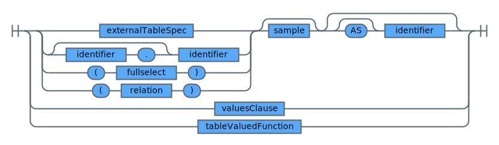
</div>

<h3 id="externalTableSpec">externalTableSpec</h3>

An external table specification represents an URI for an object stored on Cloud {{site.data.keyword.cos_short}} combined with a specification of the object type. Valid values for object type identifier are `AVRO`, `CSV`, `JSON`, `ORC`, or `PARQUET`.

If the file format is CSV, the optional `FIELDS TERMINATED BY` clause allows you to specify a field delimiter/separator other than the default `,` (comma). For example, a query for parsing a CSV with `|` (vertical bar) as the delimiter looks like the following:

```sql
SELECT *
   FROM cos://us-geo/sql/BlackFriday.csv
       STORED AS CSV FIELDS TERMINATED BY '|'
   LIMIT 3`
```
All single Unicode characters are allowed as delimiters.

By default, it is assumed that CSV input objects have a header line that specifies the names of the input columns.  If the objects don't have a header line, you have to specify the option `NOHEADER` in the `STORED AS CSV` clause. In this case, the names _C0, _C1, ... are used for the input columns.
Refer to section [COS URI](#COSURI) for more details.

By default, if the format of the input data is JSON, each line must contain a separate, self-contained, and valid JSON object, also called newline-delimited JSON. However, if you specify the option `MULTILINE`, {{site.data.keyword.sqlquery_short}} can process JSON input data even if individual data records span multiple lines, such as when the data has been formatted to make it easier to read. Only specify this option if you really need it, because it limits input parallelization and can significantly reduce performance when processing large volumes of JSON data. If you need to frequently query large amounts of multiline JSON data, use {{site.data.keyword.sqlquery_short}} to transform the data into single -line JSON, or into a more performance optimized format, such as Parquet, before querying the transformed data.

If the file format is Parquet, the optional `MERGE SCHEMA` clause allows you to handle Parquet schema evolution by specifying that all qualifying Parquet objects should be scanned for their schema and the final schema should be merged across all objects. Note that by default, for Parquet input only the first Parquet object found is used to infer the schema, which guarantees minimal overhead for compiling the SQL. Thus, use this option if your Parquet input data does not have a homogeneous schema.

<div style="overflow-x : auto;">
<map name="externalTableSpecImgMap">
	<area alt="section COSURI" shape="rect" coords="70,30,138,52" href="#COSURI" />
	<area alt="section STRING" shape="rect" coords="750,70,818,92" href="#STRING" />
</map>
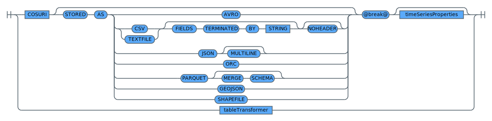
</div>

<h3 id="tableTransformer">tableTransformer</h3>

A table transformer is a function that is applied to the input data set before it is sent to the actual SQL query compilation and execution.

You can wrap your external table definition optionally with the `FLATTEN` table transformation function.
It will preprocess your input table before query compilation to a fully flat column schema.
This can be useful when you have hierarchical input data as it is often found in JSON documents.
By using `FLATTEN`, you don't have to dereference all nested columns explicitly in your SQL statement.

For example, you can run a simple `SELECT * FROM FLATTEN(cos://us-geo/sql/iotmessages STORED AS JSON)` on a flattened JSON
input and use CSV output to easily browse a sample of your JSON input data.

The `FLATTEN` table transformation function creates a flat list of columns by concatenating all nested column names with _.
You can optionally also combine `FLATTEN` with `CLEANCOLS`.

You can wrap your external table definition optionally with the `CLEANCOLS` table transformation function.
It will preprocess your input table before query compilation by renaming all columns that have characters that are NOT supported by certain target formats, such as Parquet.
These characters are `,`, `;`, `,,,`, `=`, `(`, `)`, `{` and `}`. They are replaced by the corresponding URL-encoded representation, for example, %20 for space (` `). This allows you to write results, for example, into Parquet without having to provide column by column alias names in your SQL
when your input data has columns with these characters. A typical situation is the existence of space (` `) in input columns.

For example, you can use `SELECT * FROM CLEANCOLS(cos://us-geo/sql/iotmessages STORED AS JSON) INTO cos://us-geo/mybucket/myprefix STORED AS PARQUET` to produce a result set that can be stored as is into Parquet target format.

You can optionally also combine `CLEANCOLS` with `FLATTEN`.

If you wrap your external table definition with the `DESCRIBE` table transformer,
the table does not show its actual content but the schema that is inferred from the objects in {{site.data.keyword.cos_full}} instead.
This allows you to explore the schema before authoring your actual SQL statements against it.

When you use the `DESCRIBE` table transformer in your SQL statement, the default output format is JSON instead of CSV.

You can also wrap `DESCRIBE` around the other table transformers in order to explore the transformed table schema.
However, you cannot wrap other table transformers around the `DESCRIBE` transformer.

<div style="overflow-x : auto;">
<map name="tableTransformerImgMap">
	<area alt="section externalTableSpec" shape="rect" coords="230,20,386,42" href="#externalTableSpec" />
</map>

</div>

<h3 id="tableValuedFunction">tableValuedFunction</h3>

A table-valued function returns a relation, that is, a set of rows. An example of a table-valued function is `range()`. Refer to the section about [SQL functions](/docs/services/sql-query?topic=sql-query-sqlfunctions#sqlfunctions) for more details.

<div style="overflow-x : auto;">
<map name="tableValuedFunctionImgMap">
	<area alt="section identifier" shape="rect" coords="50,30,150,52" href="#identifier" />
	<area alt="section expression" shape="rect" coords="258,30,358,52" href="#expression" />
</map>

</div>

<h3>More Topics</h3>

For further details about the clauses used in a all *relation* clauses refer to the following topics:
* [booleanExpression](#booleanExpression)
* [COSURI](#COSURI)
* [expression](#expression)
* [fullselect](#fullselect)
* [identifier](#identifier)
* [joinType](#joinType)
* [sample](#sample)
* [valuesClause](#valuesClause)

<h3>Related References</h3>

A *relation* is referenced by the following clause:

* [simpleselect](#simpleselect)

### Values Clause
{: #chapterValuesClause}

A *values clause* is a component of a *fullselect* or represents a *primary relation*. Its syntax is defined by the syntax diagram below.

<h3 id="valuesClause">valuesClause</h3>

<div style="overflow-x : auto;">
<map name="valuesClauseImgMap">
	<area alt="section expression" shape="rect" coords="158,40,258,62" href="#expression" />
	<area alt="section identifier" shape="rect" coords="394,40,494,62" href="#identifier" />
</map>

</div>

A values clause lets you define a result set by specifying actual values for each column of a row by means of expressions.

Each `expression` in the list of expressions represents a row of the result set that is defined.

In case of a single-column result set, each expression represents the value of this column in a row.

In case of a multi-column result set, each expression represents a list of *n* expressions enclosed by parantheses, where *n* is the number of columns in the result set.

To join a *values clause* with other types of result sets, specify an `identifier` that acts as an **alias** for the values clause.

<h3>Examples</h3>

```sql
-- single column result set with 3 rows
SELECT * FROM VALUES 1, 2 , 3
```
{: codeblock}


The result of the example query is shown in the table below.

|COL1|
|----|
|1   |
|2   |
|3   |
{: caption="Table 11. Query result for example 'single column result set with 3 rows'" caption-side="top"}


```sql
-- single column result set with 3 rows specifying parantheses for row expressions
SELECT * FROM VALUES (1), (2) , (3)
```
{: codeblock}


The result of the example query is shown in the table below.

|COL1|
|----|
|1   |
|2   |
|3   |
{: caption="Table 12. Query result for example 'single column result set with 3 rows specifying parantheses for row expressions'" caption-side="top"}


```sql
--- joining two multi column result sets using their identifier
SELECT
    emp.col1 AS id,
    emp.col2 AS name,
    mission.col2 AS missions
FROM
    VALUES
        (1, 'Spock'),
        (2,'Kirk') ,
        (3, 'McCoy'),
        (4,'Scotty') AS emp,
    VALUES
        (1,3000),
        (2,2000),
        (3,3000),
        (4,4000) AS mission
WHERE emp.col1 = mission.col1
```
{: codeblock}


The result of the example query is shown in the table below.

|ID |NAME  |MISSIONS|
|---|------|--------|
|1  |Spock |3000    |
|2  |Kirk  |2000    |
|3  |McCoy |3000    |
|4  |Scotty|4000    |
{: caption="Table 13. Query result for example 'joining two multi column result sets using their identifier'" caption-side="top"}


### Values Statement
{: #chapterValuesStatement}

A *values statement* is a standalone statement on its own. It can be used instead of a *fullselect* if your statement only
references a single value and does not contain any join with other relations or values clauses.

<h3>Examples</h3>

```sql
-- values statement with single column result set with 3 rows
VALUES 1, 2, 3
```
{: codeblock}


The result of the example query is shown in the table below.

|COL1|
|----|
|1   |
|2   |
|3   |
{: caption="Table 14. Query result for example 'values statement with single column result set with 3 rows'" caption-side="top"}


```sql
--- values statement with multi column result set
VALUES
        (1, 'Spock'),
        (2,'Kirk') ,
        (3, 'McCoy'),
        (4,'Scotty')
```
{: codeblock}

The result of the example query is shown in the table below.

|COL1|COL2  |
|----|------|
|1   |Spock |
|2   |Kirk  |
|3   |McCoy |
|4   |Scotty|
{: caption="Table 15. Query result for example 'values statement with multi column result set'" caption-side="top"}


<h3>More Topics</h3>
For further details about the clauses used in a *values clause*, refer to the following topics:
* [expression](#expression)
* [identifier](#identifier)

<h3>Related References</h3>

A *values clause* is referenced by the following clauses
* [fullselect](#fullselect)
* [relationPrimary](#relationPrimary)

### Lateral Views
{: #chapterLateralViews}

A lateral view is a component of a *simpleselect*. Lateral views allow to build  *virtual tables* at query execution time
by means of *table-generating functions*. Examples of table-generating functions are `explode()`, `posexplode()`, and `posexplode_outer()`.
The explode()-style functions take an array or map as input and return a row for each element in the array. Refer to the section about [SQL functions](/docs/services/sql-query?topic=sql-query-sqlfunctions#sqlfunctions) for more details.

<h3 id="lateralView">lateralView</h3>

The syntax of a lateral view clause is described by the syntax diagram below.

<div style="overflow-x : auto;">
<map name="lateralViewImgMap">
	<area alt="section qualifiedName" shape="rect" coords="318,40,442,62" href="#qualifiedName" />
	<area alt="section expression" shape="rect" coords="139,123,239,145" href="#expression" />
	<area alt="section identifier" shape="rect" coords="51,236,151,258" href="#identifier" />
	<area alt="section identifier" shape="rect" coords="287,236,387,258" href="#identifier" />
</map>

</div>

The semantics of the entities in order of appearance in the syntax diagrams is as follows:
* `OUTER`: Specifying this keyword ensures that the lateral view contains at least one row with *null* values in case the table-generating function does not return any rows.
* `qualifiedName`: Name of a table-generating function.
* `expression`: An expression resolving to an array.
* `identifier`: Lateral view name, that is, the name of the new virtual table.
* `identifier`: Lateral view column names.

<h3>Examples</h3>

Lateral views are useful when dealing with repeating groups within a table, that is, not normalized tables. The examples show how to deal with tables that represent a 1-n relation and a n-m relation.

```sql
-- deal with a 1-n relation

SELECT
    master_child.col1 AS master_id,
    child_table.child_id
FROM VALUES
    ( 1 , ARRAY(1,2,3)),
    (2, ARRAY(4,5,6)) AS master_child
LATERAL VIEW EXPLODE(master_child.col2) child_table AS child_id
```
{: codeblock}


The result of the example query is shown in the table below.

|MASTER_ID|CHILD_ID|
|---------|--------|
|1        |1       |
|1        |2       |
|1        |3       |
|2        |4       |
|2        |5       |
|2        |6       |
{: caption="Table 16. Query result for example 'deal with a 1-n relation'" caption-side="top"}


```sql
-- deal with a n-m relation

SELECT
    master_table.master_id,
    child_table.child_id
FROM VALUES
    ( ARRAY(10,20) , ARRAY(1,2,3)),
    ( ARRAY(30,40), ARRAY(4,5,6)) AS master_child
LATERAL VIEW EXPLODE(master_child.col1) master_table AS master_id
LATERAL VIEW EXPLODE(master_child.col2) child_table AS child_id
```
{: codeblock}

The result of the example query is shown in the table below.

|MASTER_ID|CHILD_ID|
|---------|--------|
|10       |1       |
|10       |2       |
|10       |3       |
|20       |1       |
|20       |2       |
|20       |3       |
|30       |4       |
|30       |5       |
|30       |6       |
|40       |4       |
|40       |5       |
|40       |6       |
{: caption="Table 17. Query result for example 'deal with a n-m relation'" caption-side="top"}


<h3>More Topics</h3>

For further details about the clauses used in a *lateral view* clause, refer to the following topics:
* [expression](#expression)
* [identifier](#identifier)
* [qualifiedName](#qualifiedName)

Note:
* A *simpleselect* can contain multiple lateral view clauses that are evaluated in order of appearance.
* Within a lateral view clause, you can refer to columns defined in any (virtual) table left to the current lateral view clause.

<h3>Related References</h3>

A *lateral view* clause is referenced by a [simpleselect](#simpleselect).

### Join Types
{: #chapterJoinTypes}

SELECT statements can retrieve and join column values from two or more tables into a single row. The retrieval is based on a specified condition, typically of matching column values.

The main characteristic of a join is, typically, matching column values in rows of each table that participates in the join. The result of a join associates rows from one table with rows from another table. Depending on the type of join operation, some rows might be formed that contain column values in one table that do not match column values in another table.

A joined table specifies an intermediate result table that is the result of either an `INNER` join, an `OUTER` join, a `CROSS` join, or an `ANTI` join.
The table is derived by applying one of the join operators to its operands.

<h3 id="joinType">joinType</h3>

<div style="overflow-x : auto;">
<map name="joinTypeImgMap">
</map>
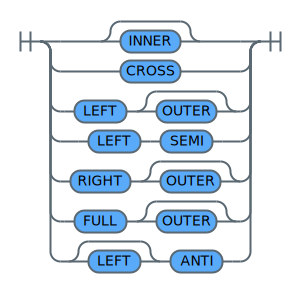
</div>

<h4>Inner Join</h4>

An `INNER` join combines each row of the left table with each row of the right table, keeping only the rows in which the join condition is true.

```sql
-- inner join query
SELECT
    left_table.col1 AS l_col1,
    left_table.col2 AS l_col2,
    right_table.col1 AS r_col1,
    right_table.col2 AS r_col2
FROM
    VALUES (0, 10), (1, 11), (2, 12), (3,13), (4, 14), (5, 14) AS left_table
    INNER JOIN
    VALUES (0, 10), (2, 12), (4, 14), (6, 16) AS right_table
    ON left_table.col1 = right_table.col1
```
{: codeblock}


The result of the example query is shown in the table below.

|L_COL1|L_COL2|R_COL1|R_COL2|
|------|------|------|------|
|0     |10    |0     |10    |
|2     |12    |2     |12    |
|4     |14    |4     |14    |
{: caption="Table 18. Query result for example 'inner join query'" caption-side="top"}


<h4>Outer Join</h4>

An `OUTER` join includes the rows that are produced by the inner join, plus the missing rows, depending on the type of outer join.

A `LEFT OUTER` or `LEFT` join includes the rows from the left table that were missing from the inner join.

```sql
-- left outer join query
SELECT
    left_table.col1 AS l_col1,
    left_table.col2 AS l_col2,
    right_table.col1 AS r_col1,
    right_table.col2 AS r_col2
FROM VALUES (0, 10), (1, 11), (2, 12), (3,13), (4, 14), (5, 14) AS left_table
LEFT OUTER JOIN
VALUES (0, 10), (2, 12), (4, 14), (6, 16) AS right_table
ON left_table.col1 = right_table.col1
```
{: codeblock}


The result of the example query is shown in the table below.

|L_COL1|L_COL2|R_COL1|R_COL2|
|------|------|------|------|
|0     |10    |0     |10    |
|1     |11    |null  |null  |
|2     |12    |2     |12    |
|3     |13    |null  |null  |
|4     |14    |4     |14    |
|5     |14    |null  |null  |
{: caption="Table 19. Query result for example 'left outer join query'" caption-side="top"}


A `RIGHT OUTER` or `RIGHT` join includes the rows from the right table that were missing from the inner join.

```sql
-- right outer join query
SELECT
    left_table.col1 AS l_col1,
    left_table.col2 AS l_col2,
    right_table.col1 AS r_col1,
    right_table.col2 AS r_col2
FROM
    VALUES (0, 10), (1, 11), (2, 12), (3,13), (4, 14), (5, 14) AS left_table
    RIGHT OUTER JOIN
    VALUES (0, 10), (2, 12), (4, 14), (6, 16) AS right_table
    ON left_table.col1 = right_table.col1
```
{: codeblock}


The result of the example query is shown in the table below.

|L_COL1|L_COL2|R_COL1|R_COL2|
|------|------|------|------|
|0     |10    |0     |10    |
|2     |12    |2     |12    |
|4     |14    |4     |14    |
|null  |null  |6     |16    |
{: caption="Table 20. Query result for example 'right outer join query'" caption-side="top"}


A `FULL OUTER` or `FULL` join includes the rows from both tables that were missing from the inner join.

```sql
-- full outer join query
SELECT
    left_table.col1 AS l_col1,
    left_table.col2 AS l_col2,
    right_table.col1 AS r_col1,
    right_table.col2 AS r_col2
FROM
    VALUES (0, 10), (1, 11), (2, 12), (3, 13), (4, 14), (5, 14) AS left_table
    FULL OUTER JOIN
    VALUES (0, 10), (2, 12), (4, 14), (6, 16) AS right_table
    ON left_table.col1 = right_table.col1
```
{: codeblock}


The result of the example query is shown in the table below.

|L_COL1|L_COL2|R_COL1|R_COL2|
|------|------|------|------|
|1     |11    |null  |null  |
|null  |null  |6     |16    |
|3     |13    |null  |null  |
|5     |14    |null  |null  |
|4     |14    |4     |14    |
|2     |12    |2     |12    |
|0     |10    |0     |10    |
{: caption="Table 21. Query result for example 'full outer join query'" caption-side="top"}


<h4>Cross Join</h4>

A `CROSS` join creates a Cartesian product of the tables involved in the join operation, if a CROSS join specifying a join condition behaves like an inner join.

```sql
-- cross join specifying a join condition

SELECT
    left_table.col1 AS l_col1,
    left_table.col2 AS l_col2,
    right_table.col1 AS r_col1,
    right_table.col2 AS r_col2
FROM
    VALUES (0, 10), (1, 11), (2, 12), (3,13), (4, 14), (5, 14) AS left_table
    CROSS JOIN VALUES (0, 10), (2, 12), (4, 14), (6, 16) AS right_table
    ON left_table.col1 = right_table.col1
```
{: codeblock}


The result of the example query is shown in the table below.

|L_COL1|L_COL2|R_COL1|R_COL2|
|------|------|------|------|
|0     |10    |0     |10    |
|2     |12    |2     |12    |
|4     |14    |4     |14    |
{: caption="Table 22. Query result for example 'cross join specifying a join condition'" caption-side="top"}


```sql
-- cross join specifying no join condition
SELECT
    left_table.col1 AS l_col1,
    left_table.col2 AS l_col2,
    right_table.col1 AS r_col1,
    right_table.col2 AS r_col2
FROM
    VALUES (0, 10), (1, 11), (2, 12), (3,13), (4, 14), (5, 14) AS left_table
    CROSS JOIN VALUES (0, 10), (2, 12), (4, 14), (6, 16) AS right_table
```
{: codeblock}


The result of the example query is shown in the table below.

|L_COL1|L_COL2|R_COL1|R_COL2|
|------|------|------|------|
|0     |10    |0     |10    |
|0     |10    |2     |12    |
|0     |10    |4     |14    |
|0     |10    |6     |16    |
|1     |11    |0     |10    |
|1     |11    |2     |12    |
|1     |11    |4     |14    |
|1     |11    |6     |16    |
|2     |12    |0     |10    |
|2     |12    |2     |12    |
|2     |12    |4     |14    |
|2     |12    |6     |16    |
|3     |13    |0     |10    |
|3     |13    |2     |12    |
|3     |13    |4     |14    |
|3     |13    |6     |16    |
|4     |14    |0     |10    |
|4     |14    |2     |12    |
|4     |14    |4     |14    |
|4     |14    |6     |16    |
|5     |14    |0     |10    |
|5     |14    |2     |12    |
|5     |14    |4     |14    |
|5     |14    |6     |16    |
{: caption="Table 23. Query result for example 'cross join specifying no join condition'" caption-side="top"}


<h4>Anti Join</h4>

A `LEFT ANTI` or `ANTI` join returns only rows from the left table that do not have a matching row in the right table.
Note that no columns from the right table can be included in the column list of the select statement.

```sql
-- left anti join query
SELECT
    left_table.col1 AS l_col1,
    left_table.col2 AS l_col2
FROM
    VALUES (0, 10), (1, 11), (2, 12), (3,13), (4, 14), (5, 14) AS left_table
    ANTI JOIN
    VALUES (0, 10), (2, 12), (4, 14), (6, 16) AS right_table
    ON left_table.col1 = right_table.col1
```
{: codeblock}


The result of the example query is shown in the table below.

|L_COL1|L_COL2|
|------|------|
|1     |11    |
|3     |13    |
|5     |14    |
{: caption="Table 24. Query result for example 'left anti join query'" caption-side="top"}


<h4>Left Semi Join</h4>

A `LEFT SEMI` join acts like an inner join but does not include the columns of the right table.

```sql
-- left semi join query
SELECT
    left_table.col1 AS l_col1,
    left_table.col2 AS l_col2
FROM
    VALUES (0, 10), (1, 11), (2, 12), (3,13), (4, 14), (5, 14) AS left_table
    LEFT SEMI JOIN
    VALUES (0, 10), (2, 12), (4, 14), (6, 16) AS right_table
    ON left_table.col1 = right_table.col1
```
{: codeblock}

The result of the example query is shown in the table below.

|L_COL1|L_COL2|
|------|------|
|0     |10    |
|2     |12    |
|4     |14    |
{: caption="Table 25. Query result for example 'left semi join query'" caption-side="top"}


<h3>Related References</h3>

The *join types* are specified in a [relation](#relation).

### Sampling Table Data
{: #chapterSamplingTableData}

Any table, that is, object stored on Cloud {{site.data.keyword.cos_short}}, used in a *from clause*, can be associated with a *table sample clause*.
The table sample clause defines how to retrieve a subset of rows from the underlying table (object stored on Cloud {{site.data.keyword.cos_short}}). This lets you write queries for samples of the data, for example, for the purpose of interactive data exploration, data mining, and so on.

The general syntax of a table sample clause is described by the syntax diagram below.

<h3 id="sample">sample</h3>

<div style="overflow-x : auto;">
<map name="sampleImgMap">
	<area alt="section unsignedNumber" shape="rect" coords="246,20,378,42" href="#unsignedNumber" />
	<area alt="section expression" shape="rect" coords="264,60,364,82" href="#expression" />
	<area alt="section bucketSampleClause" shape="rect" coords="278,90,442,112" href="#bucketSampleClause" />
</map>
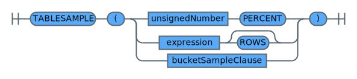
</div>

<h3 id="bucketSampleClause">bucketSampleClause</h3>

<div style="overflow-x : auto;">
<map name="bucketSampleClauseImgMap">
	<area alt="section unsignedInteger" shape="rect" coords="138,20,278,42" href="#unsignedInteger" />
	<area alt="section unsignedInteger" shape="rect" coords="418,20,558,42" href="#unsignedInteger" />
</map>
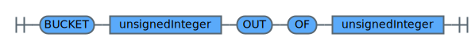
</div>

Three sampling types are supported:

* `TABLESAMPLE <number> PERCENT` lets you sample a certain percentage of rows from the underlying table.
* `TABLESAMPLE <expression> ROWS` lets you sample a certain number of rows from the underlying table.
* `TABLESAMPLE BUCKET x OUT OF y` lets you bucketize the underlying data into `y` buckets and returns rows from bucket `x`. Buckets are numbered from `1`to `y`.

<h3>Examples</h3>

The following examples demonstrate how to sample a subset of data from a Parquet object on Cloud {{site.data.keyword.cos_short}}.
Note that the object referenced is accessible from the web UI as part of the provided sample queries.

```sql
-- retrieve 10 percent of employee data
SELECT * FROM cos://us-geo/sql/employees.parquet STORED AS PARQUET TABLESAMPLE (10 PERCENT)
```
{: codeblock}

```sql
-- retrieve 10 rows from the employee data object
SELECT * FROM cos://us-geo/sql/employees.parquet STORED AS PARQUET TABLESAMPLE (10 ROWS)
```
{: codeblock}

```sql
-- bucketize the employee data in 10 buckets and retrieve data from 2 buckets
SELECT * FROM cos://us-geo/sql/employees.parquet STORED AS PARQUET TABLESAMPLE (BUCKET 2 OUT OF 10)
```
{: codeblock}

<h3>More Topics</h3>

For further details about the clauses used in a *table sample clause*, refer to the following topics:
 * [expression](#expression)
 * [identifier](#identifier)
 * [qualifiedName](#qualifiedName)
 * [unsignedInteger](#unsignedInteger)
 * [unsignedNumber](#unsignedNumber)

<h3>Related References</h3>

A *table sample clause* is referenced by the following clause:
* [relationPrimary](#relationPrimary)

## SQL Functions
{: #chapterSqlFunctions}

The syntax for SQL function invocation is described by the syntax diagram below.

<h3 id="functionOrAggregate">functionOrAggregate</h3>

<div style="overflow-x : auto;">
<map name="functionOrAggregateImgMap">
	<area alt="section qualifiedName" shape="rect" coords="70,40,194,62" href="#qualifiedName" />
	<area alt="section expression" shape="rect" coords="466,40,566,62" href="#expression" />
	<area alt="section windowSpec" shape="rect" coords="766,40,866,62" href="#windowSpec" />
	<area alt="section expression" shape="rect" coords="430,100,530,122" href="#expression" />
	<area alt="section expression" shape="rect" coords="622,100,722,122" href="#expression" />
	<area alt="section expression" shape="rect" coords="360,200,460,222" href="#expression" />
	<area alt="section expression" shape="rect" coords="548,200,648,222" href="#expression" />
	<area alt="section valueExpression" shape="rect" coords="352,230,492,252" href="#valueExpression" />
	<area alt="section valueExpression" shape="rect" coords="568,230,708,252" href="#valueExpression" />
	<area alt="section expression" shape="rect" coords="292,270,392,292" href="#expression" />
	<area alt="section expression" shape="rect" coords="460,270,560,292" href="#expression" />
	<area alt="section expression" shape="rect" coords="648,270,748,292" href="#expression" />
	<area alt="section expression" shape="rect" coords="364,310,464,332" href="#expression" />
	<area alt="section expression" shape="rect" coords="336,350,436,372" href="#expression" />
	<area alt="section booleanExpression" shape="rect" coords="524,350,680,372" href="#booleanExpression" />
	<area alt="section expression" shape="rect" coords="360,390,460,412" href="#expression" />
	<area alt="section expression" shape="rect" coords="332,430,432,452" href="#expression" />
	<area alt="section booleanExpression" shape="rect" coords="520,430,676,452" href="#booleanExpression" />
	<area alt="section resultColumn" shape="rect" coords="464,470,580,492" href="#resultColumn" />
</map>

</div>

Most function invocations look like `function(argument1, ..., argumentN)` but functions like `TRIM()`, `POSITION()`, `FIRST()`, `LAST()`, and `STRUCT()` support a different invocation style.

Refer to section [SQL functions](/docs/services/sql-query?topic=sql-query-sqlfunctions#sqlfunctions) for details about supported functions.

<h3>More Topics</h3>

For further details about the clauses used in a *function or aggregate* clause, refer to the following topics:
* [expression](#expression)
* [qualifiedName](#qualifiedName)
* [resultColumn](#resultColumn)
* [valueExpression](#valueExpression)
* [windowSpec](#windowSpec)

<h3>Related References</h3>

A *function or aggregate clause* is referenced by the following clause:
* [primaryExpression](#primaryExpression)

### Window Functions
{: #chapterWindowFunctions}

Classic SQL **aggregation functions** like `SUM()`, `MAX()`, or `MIN()` process a group of rows to derive a single value. **Window functions** take this one step further by allowing to process a group of rows and derive a single value for each row in the group. Note that this is not the same as **scalar functions** that return a single value for each row. Scalar functions derive a single value from a single row and not a group of rows.

With window functions it is possible to calculate things like *moving averages* or *cumulative sums*.

Working with window functions involves two steps:
1. Choose a *window function* to answer the question of interest.
2. Define a *window* the chosen window function is applied to.

There are three types of window functions:

1. **Ranking functions**, for example, `rank()`, `ntile()`, or `rowNumber()`
2. **Analytic functions**, for example, `cume_dist()`, `first_value()`, or `last_value()`
3. **Aggregation functions**, for example, `sum()`, `max()`, or `min()`

Refer to the section about [SQL functions](/docs/services/sql-query?topic=sql-query-sqlfunctions#sqlfunctions) for more detailed information.

A window can be defined in two ways:
* The `WINDOW` keyword lets you define an identifier for a window specification in a *fullselect* or *simpleselect*. This named window specification can then be referenced by the `OVER` keyword.
* Unnamed window specifications can be defined inline following the keyword `OVER` in a *fullselect* or *simpleselect*.

The syntax of a window specification is defined by the syntax diagrams below.

<h3 id="namedWindows">namedWindows</h3>

<div style="overflow-x : auto;">
<map name="namedWindowsImgMap">
	<area alt="section namedWindow" shape="rect" coords="158,20,266,42" href="#namedWindow" />
</map>

</div>

<h3 id="namedWindow">namedWindow</h3>

<div style="overflow-x : auto;">
<map name="namedWindowImgMap">
	<area alt="section identifier" shape="rect" coords="50,20,150,42" href="#identifier" />
	<area alt="section windowSpec" shape="rect" coords="226,20,326,42" href="#windowSpec" />
</map>

</div>

<h3 id="windowSpec">windowSpec</h3>

<div style="overflow-x : auto;">
<map name="windowSpecImgMap">
	<area alt="section identifier" shape="rect" coords="332,20,432,42" href="#identifier" />
	<area alt="section windowClusterBy" shape="rect" coords="238,60,378,82" href="#windowClusterBy" />
	<area alt="section windowPartitionBy" shape="rect" coords="148,100,304,122" href="#windowPartitionBy" />
	<area alt="section windowOrderBy" shape="rect" coords="344,100,468,122" href="#windowOrderBy" />
	<area alt="section windowFrame" shape="rect" coords="528,60,636,82" href="#windowFrame" />
</map>

</div>

<h3 id="windowClusterBy">windowClusterBy</h3>

<div style="overflow-x : auto;">
<map name="windowClusterByImgMap">
	<area alt="section expression" shape="rect" coords="222,20,322,42" href="#expression" />
</map>

</div>

<h3 id="windowPartitionBy">windowPartitionBy</h3>

<div style="overflow-x : auto;">
<map name="windowPartitionByImgMap">
	<area alt="section expression" shape="rect" coords="266,20,366,42" href="#expression" />
</map>

</div>

<h3 id="windowOrderBy">windowOrderBy</h3>

<div style="overflow-x : auto;">
<map name="windowOrderByImgMap">
	<area alt="section sortItem" shape="rect" coords="226,20,310,42" href="#sortItem" />
</map>

</div>

The window specification consists of the following clauses:
* The `PARTITION BY` clause defines which rows belong to the same *window partition*. `DISTRIBUTE BY` can be used as a synonym for `PARTITION BY`.
* The `ORDER BY` clause defines the ordering of rows within a window partition. `SORT BY` can be used as a synonym for `ORDER BY`.
* There are two ways to define a *window size*:
    * `RANGE`: The window size is defined as a value range.
    * `ROW`: The window size is defined as the number of rows before and/or after the current row.
* The following keywords can be used to define range boundaries:
    * `CURRENT ROW`: Specifies to use the current row as a bound.
    * `UNBOUNDED`: Specifies to use negative or positive infinity as a lower or upper bound respectively.
    * Depending on the context `PRECEDING` specifies:
        * `RANGE`: The lower bound of the value range.
        * `ROWS`: The number of rows before the current row.
    * Depending on the context `FOLLOWING` specifies:
        * `RANGE`: The upper bound of the value range.
        * `ROWS`: The number of rows after the current row.

<h3 id="windowFrame">windowFrame</h3>

<div style="overflow-x : auto;">
<map name="windowFrameImgMap">
	<area alt="section frameBound" shape="rect" coords="290,20,390,42" href="#frameBound" />
	<area alt="section frameBound" shape="rect" coords="286,50,386,72" href="#frameBound" />
	<area alt="section frameBound" shape="rect" coords="246,80,346,102" href="#frameBound" />
	<area alt="section frameBound" shape="rect" coords="430,80,530,102" href="#frameBound" />
	<area alt="section frameBound" shape="rect" coords="242,110,342,132" href="#frameBound" />
	<area alt="section frameBound" shape="rect" coords="426,110,526,132" href="#frameBound" />
</map>
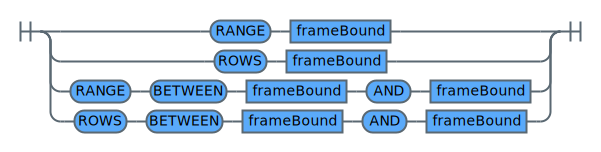
</div>

<h3 id="frameBound">frameBound</h3>

<div style="overflow-x : auto;">
<map name="frameBoundImgMap">
	<area alt="section expression" shape="rect" coords="70,110,170,132" href="#expression" />
</map>

</div>

<h3>Examples</h3>

The window function examples below use *values clauses* to define result sets for group by operations. For more details about the values clause refer to [valuesClause](#valuesClause).

<h4>Ranking Function Example</h4>

This example uses a table containing information about employee social media activity (posts):
* Column 1: employee ID
* Column 2: department ID
* Column 3: number of social media posts

The example shows how to retrieve the ID of the two most active employees in each department.

```sql
-- derive posts ranking using a named window specification
SELECT *
FROM (
    SELECT
        posts.col1 AS emp_id,
        posts.col2 AS dept_id,
        posts.col3 AS posts,
        DENSE_RANK() OVER post_ranking AS rank
    FROM VALUES
        (1, 1 ,100),
        (2, 1 ,50),
        (8, 1 ,250),
        (3, 2 ,200),
        (4, 2 ,300),
        (9, 2 ,1000),
        (5, 3 ,300),
        (6, 3 ,100),
        (7, 3 ,400) AS posts
    WINDOW post_ranking AS (
        PARTITION BY posts.col2
        ORDER BY posts.col3 DESC
    ROWS BETWEEN UNBOUNDED PRECEDING AND CURRENT ROW)
)
WHERE rank <= 2
```
{: codeblock}

The result of the example query is shown in the table below.

|EMP_ID|DEPT_ID|POSTS|RANK|
|------|-------|-----|----|
|8     |1      |250  |1   |
|1     |1      |100  |2   |
|7     |3      |400  |1   |
|5     |3      |300  |2   |
|9     |2      |1000 |1   |
|4     |2      |300  |2   |
{: caption="Table 26. Query result for example 'derive posts ranking using a named window specification'" caption-side="top"}


```sql
-- derive posts ranking using an inline window specification
SELECT * FROM (
    SELECT
        posts.col1 AS emp_id,
        posts.col2 AS dept_id,
        posts.col3 AS posts,
        DENSE_RANK() OVER (
                        PARTITION BY posts.col2
                        ORDER BY posts.col3 DESC
                        ROWS BETWEEN UNBOUNDED PRECEDING AND CURRENT ROW
                        ) AS rank
        FROM VALUES
            (1, 1 ,100),
            (2, 1 ,50),
            (8, 1 ,250),
            (3, 2 ,200),
            (4, 2 ,300),
            (9, 2 ,1000),
            (5, 3 ,300),
            (6, 3 ,100),
            (7, 3 ,400) AS posts
) WHERE rank <= 2
```
{: codeblock}

The result of the example query is shown in the table below.

|EMP_ID|DEPT_ID|POSTS|RANK|
|------|-------|-----|----|
|8     |1      |250  |1   |
|1     |1      |100  |2   |
|7     |3      |400  |1   |
|5     |3      |300  |2   |
|9     |2      |1000 |1   |
|4     |2      |300  |2   |
{: caption="Table 27. Query result for example 'derive posts ranking using an inline window specification'" caption-side="top"}


<h4>Analytic Function Example</h4>

This example uses a table containing transaction information. The layout is as follows:
* Column 1: transaction ID
* Column 2: account number
* Column 3: transaction amount

The example shows how to create a cumulative distribution of transaction amounts using the analytic function `CUME_DIST()`.
The `CUME_DIST()` function returns the percentage of rows having a value less than or equal to the current row’s value.

```sql
-- cumulative distribution of transaction amounts
SELECT
    txn_amount,
    MAX(balance_dist)
FROM (
        SELECT
            txn.col2 AS account,
            txn.col3 AS txn_amount,
            CUME_DIST() OVER current_balance AS balance_dist
        FROM VALUES
            (1, 42, 1000),
            (2, 4711, 2000),
            (3, 42, -200),
            (4, 42, -200),
            (5, 4711, 1000),
            (6, 4711, -300),
            (7, 4711, -300),
            (8, 42, 1000),
            (9, 4711, -400) AS txn
        WINDOW current_balance AS (ORDER BY txn.col3)
        ORDER BY txn.col3
)
GROUP BY txn_amount
```
{: codeblock}

The result of the example query is shown in the table below.

|TXN_AMOUNT|MAX(BALANCE_DIST) |
|----------|------------------|
|-400      |0.1111111111111111|
|-300      |0.3333333333333333|
|-200      |0.5555555555555556|
|1000      |0.8888888888888888|
|2000      |1.0               |
{: caption="Table 28. Query result for example 'cumulative distribution of transaction amounts'" caption-side="top"}


<h4>Aggregation Function Example</h4>

This example uses a table containing transaction information. The layout is as follows:
* Column 1: transaction ID
* Column 2: account number
* Column 3: transaction amount

The example shows how to retrieve the *total balanace* of each account at the time of each transaction.

```sql
--- total balance of each account at the time of each transaction
SELECT
    txn.col1 AS txn_id,
    txn.col2 AS account,
    txn.col3 AS txn_amount,
    SUM(txn.col3) OVER current_balance AS balance
FROM VALUES
    (1, 42, 100),
    (2, 4711, 300),
    (3, 42, 50),
    (4, 42, -250),
    (5, 4711, 1000),
    (6, 4711, -300),
    (7, 4711, 100),
    (8, 42, 200),
    (9, 4711, -400) AS txn
WINDOW current_balance AS (
        PARTITION BY txn.col2
        ORDER BY txn.col1
        ROWS BETWEEN UNBOUNDED PRECEDING AND CURRENT ROW
) ORDER BY account, txn_id
```
{: codeblock}


The result of the example query is shown in the following table.

|TXN_ID|ACCOUNT|TXN_AMOUNT|BALANCE|
|------|-------|----------|-------|
|1     |42     |100       |100    |
|3     |42     |50        |150    |
|4     |42     |-250      |-100   |
|8     |42     |200       |100    |
|2     |4711   |300       |300    |
|5     |4711   |1000      |1300   |
|6     |4711   |-300      |1000   |
|7     |4711   |100       |1100   |
|9     |4711   |-400      |700    |
{: caption="Table 29. Query result for example 'total balance of each account at the time of each transaction'" caption-side="top"}


<h3>More Topics</h3>
For further details about the clauses used by a *window functions*, refer to the following topics:
* [expression](#expression)
* [identifier](#identifier)
* [sortItem](#sortItem)

<h3>Related References</h3>

A *named window clause* is referenced by the following clauses:
* [fullselect](#fullselect)
* [simpleselect](#simpleselect)

Note that the keyword `OVER` lets you define an unnamed window specification in a [functionOrAggregate](#functionOrAggregate).

## SQL Expressions
{: #chapterSqlExpressions}

<h3>Expressions</h3>

In the context of an SQL query statement, an *expression* is always a *Boolean expression*.

<h4 id="expression">expression</h4>

<div style="overflow-x : auto;">
<map name="expressionImgMap">
	<area alt="section booleanExpression" shape="rect" coords="50,20,206,42" href="#booleanExpression" />
</map>

</div>

<h4>More Topics</h4>

Refer to section [booleanExpression](#booleanExpression) for more details.

<h4>Related References</h4>

An *expression* is referenced by the following clauses:

* [caseExpression](#caseExpression)
* [castExpression](#castExpression)
* [frameBound](#frameBound)
* [fullselect](#fullselect)
* [functionOrAggregate](#functionOrAggregate)
* [groupByClause](#groupByClause)
* [groupingSet](#groupingSet)
* [lateralView](#lateralView)
* [predicate](#predicate)
* [primaryExpression](#primaryExpression)
* [resultColumn](#resultColumn)
* [sample](#sample)
* [sortItem](#sortItem)
* [tableValuedFunction](#tableValuedFunction)
* [valuesClause](#valuesClause)
* [whenClause](#whenClause)
* [windowSpec](#windowSpec)

<h3>Boolean Expressions</h3>

The syntax of a *Boolean expression* is defined by the following syntax diagrams.

<h4 id="booleanExpression">booleanExpression</h4>

<div style="overflow-x : auto;">
<map name="booleanExpressionImgMap">
	<area alt="section booleanExpression" shape="rect" coords="222,20,378,42" href="#booleanExpression" />
	<area alt="section valueExpression" shape="rect" coords="132,60,272,82" href="#valueExpression" />
	<area alt="section predicate" shape="rect" coords="302,60,394,82" href="#predicate" />
	<area alt="section booleanExpression" shape="rect" coords="70,90,226,112" href="#booleanExpression" />
	<area alt="section booleanExpression" shape="rect" coords="310,90,466,112" href="#booleanExpression" />
	<area alt="section booleanExpression" shape="rect" coords="74,120,230,142" href="#booleanExpression" />
	<area alt="section booleanExpression" shape="rect" coords="306,120,462,142" href="#booleanExpression" />
	<area alt="section query" shape="rect" coords="282,150,342,172" href="#query" />
</map>
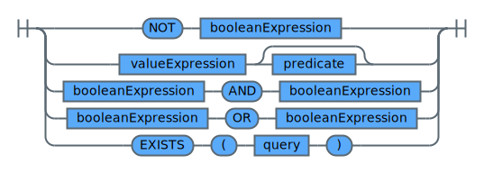
</div>

A Boolean expression is one of the following:
* A negation of a boolean expression using Boolean operator `NOT`.
* A conjunction of boolean expressions using Boolean operator `AND`.
* A conjunction of boolean expressions using Boolean operator `OR`.
* An `EXIST` predicate.
* A *value expression* optionally followed by a *predicate*.

Refer to [booleanOperator](#booleanOperator) for details about Boolean operators `NOT`, `AND`, and `OR`.

The `EXISTS` predicate tests for the existence of certain rows. The `query` can specify any number of columns, and the following applies:
* The result is true only if the number of rows specified by the fullselect is not zero.
* The result is false only if the number of rows specified is zero.
* The result cannot be unknown.

<h4>Related References</h4>

A *Boolean expression* is referenced by the following clauses:

* [booleanExpression](#booleanExpression)
* [expression](#expression)
* [relation](#relation)
* [simpleselect](#simpleselect)

<h3>Value Expressions</h3>

<h4 id="valueExpression">valueExpression</h4>

<div style="overflow-x : auto;">
<map name="valueExpressionImgMap">
	<area alt="section primaryExpression" shape="rect" coords="234,20,390,42" href="#primaryExpression" />
	<area alt="section unaryOperator" shape="rect" coords="170,50,294,72" href="#unaryOperator" />
	<area alt="section valueExpression" shape="rect" coords="314,50,454,72" href="#valueExpression" />
	<area alt="section valueExpression" shape="rect" coords="70,80,210,102" href="#valueExpression" />
	<area alt="section arithmeticOperator" shape="rect" coords="230,80,394,102" href="#arithmeticOperator" />
	<area alt="section valueExpression" shape="rect" coords="414,80,554,102" href="#valueExpression" />
	<area alt="section valueExpression" shape="rect" coords="70,110,210,132" href="#valueExpression" />
	<area alt="section comparisonOperator" shape="rect" coords="230,110,394,132" href="#comparisonOperator" />
	<area alt="section valueExpression" shape="rect" coords="414,110,554,132" href="#valueExpression" />
</map>

</div>

A *value expression* is one of the following:
* A *primary expression*.
* The result of applying an unary operator to a value expression.
* The result of performing an arithmetic operation with two value expressions.
* The result of performing a comparison operation between two value expressions.

<h4>More Topics</h4>

For further details about the clauses used by a *value expression*, refer to the following topics:
* [arithmeticOperator](#arithmeticOperator)
* [comparisonOperator](#comparisonOperator)
* [primaryExpression](#primaryExpression)
* [unaryOperator](#unaryOperator)

<h4>Related References</h4>

A *value expression* is referenced by the following clauses:
* [booleanExpression](#booleanExpression)
* [functionOrAggregate](#functionOrAggregate)
* [predicate](#predicate)

<h3>Primary Expressions</h3>

<h4 id="primaryExpression">primaryExpression</h4>

<div style="overflow-x : auto;">
<map name="primaryExpressionImgMap">
	<area alt="section caseExpression" shape="rect" coords="210,20,342,42" href="#caseExpression" />
	<area alt="section castExpression" shape="rect" coords="210,50,342,72" href="#castExpression" />
	<area alt="section constant" shape="rect" coords="234,80,318,102" href="#constant" />
	<area alt="section columnReference" shape="rect" coords="206,110,346,132" href="#columnReference" />
	<area alt="section expression" shape="rect" coords="122,140,222,162" href="#expression" />
	<area alt="section expression" shape="rect" coords="310,140,410,162" href="#expression" />
	<area alt="section query" shape="rect" coords="246,179,306,201" href="#query" />
	<area alt="section functionOrAggregate" shape="rect" coords="190,209,362,231" href="#functionOrAggregate" />
	<area alt="section primaryExpression" shape="rect" coords="70,239,226,261" href="#primaryExpression" />
	<area alt="section valueExpression" shape="rect" coords="294,239,434,261" href="#valueExpression" />
	<area alt="section primaryExpression" shape="rect" coords="114,269,270,291" href="#primaryExpression" />
	<area alt="section identifier" shape="rect" coords="338,269,438,291" href="#identifier" />
	<area alt="section expression" shape="rect" coords="226,299,326,321" href="#expression" />
</map>

</div>

<h4 id="constant">constant</h4>

<div style="overflow-x : auto;">
<map name="constantImgMap">
	<area alt="section interval" shape="rect" coords="122,50,206,72" href="#interval" />
	<area alt="section identifier" shape="rect" coords="70,80,170,102" href="#identifier" />
	<area alt="section STRING" shape="rect" coords="190,80,258,102" href="#STRING" />
	<area alt="section number" shape="rect" coords="130,110,198,132" href="#number" />
	<area alt="section STRING" shape="rect" coords="130,200,198,222" href="#STRING" />
</map>

</div>

<h4 id="interval">interval</h4>

An *interval clause* lets you define time duration constants that can be used in expressions to add or subtract time ranges from a timestamp value.

<div style="overflow-x : auto;">
<map name="intervalImgMap">
	<area alt="section unsignedNumber" shape="rect" coords="282,30,414,52" href="#unsignedNumber" />
	<area alt="section timeUnitSpec" shape="rect" coords="434,30,550,52" href="#timeUnitSpec" />
	<area alt="section STRING" shape="rect" coords="204,90,272,112" href="#STRING" />
</map>
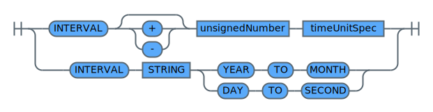
</div>

<h4 id="timeUnitSpec">timeUnitSpec</h4>

<div style="overflow-x : auto;">
<map name="timeUnitSpecImgMap">
</map>

</div>

The following time units are valid:
* Singular form: `SECOND`, `MINUTE`, `DAY`, `MONTH`, `YEAR`
* Plural form: `SECONDS`, `MINUTES`, `DAYS`, `MONTHS`, `YEARS`

Both singular and plural forms can be used interchangeably.

The following example demonstrates how to add and subtract several timeunits from the current timestamp.

```sql
-- add and subtract several timeunits from the current timestamp
SELECT
    CURRENT_TIMESTAMP
    - INTERVAL 2 YEARS
    + INTERVAL 1 MONTH
    - INTERVAL 3 DAYS
    + INTERVAL 10 HOURS
    + interval 30 MINUTES
    - INTERVAL 20 SECOND AS past_timestamp
FROM VALUES ("dummy")
```
{: codeblock}


The result of the example query is shown in the table below.

|PAST_TIMESTAMP         |
|-----------------------|
|2016-11-13 20:23:43.621|
{: caption="Table 30. Query result for example 'add and subtract several timeunits from the current timestamp'" caption-side="top"}


Since interval clauses can get quite long, especially if days, hours, minutes, and seconds are involved, it is possible to use an abbreviated syntax by specifying a format `STRING` and using the `TO` keyword.

The format `STRING` can be used to specify the following time intervals:
* `YEAR TO MONTH` interval using a format string complying to `signYEAR-MONTH` with the following:
    * `sign`: optional `+` or `-` sign
    * `YEAR`: number of years
    * `MONTH`: number of months
* `DAY TO SECOND` interval using a format string complying to `signDAY HOUR:MINUTE:SECOND` with the following:
    * `sign`: optional `+` or `-` sign
    * `DAY`: number of days
    * `HOUR`: number of hours
    * `MINUTE`: number of minutes
    * `SECOND`: number of seconds

Note that when specifying a time interval using keyword `TO`, only the singular form of a time unit `identifier` is supported.

The following table shows equivalent interval clauses:

| INTERVAL expression | INTERVAL TO expression |
| ------------------- | ---------------------- |
| INTERVAL 1 DAY - INTERVAL 2 HOURS - INTERVAL 3 MINUTES - INTERVAL 4 SECONDS | INTERVAL '1 2:3:4.100' DAY TO SECOND |
| INTERVAL 1 YEAR - INTERVAL 2 MONTH | INTERVAL '1-2' YEAR TO MONTH |
{: caption="Table 31. Equivalent INTERVAL Clauses" caption-side="top"}


The following example demonstrates equivalent interval expressions when dealing with `YEAR` and `MONTH` time units.

```sql
-- equivalent interval expressions with YEAR and MONTH time units
WITH ts AS (
    SELECT CURRENT_TIMESTAMP AS now FROM VALUES ('dummy')
    )
SELECT
  now - INTERVAL 1 YEAR - INTERVAL 2 MONTH AS LONG_VERSION,
    now - INTERVAL '1-2' YEAR TO MONTH  AS SHORT_VERSION
FROM ts
```
{: codeblock}

The result of the example query is shown in the table below.

| LONG_VERSION            | SHORT_VERSION           |
|-------------------------|-------------------------|
| 2017-08-16 10:38:07.304 | 2017-08-16 10:38:07.304 |
{: caption="Table 32. Query result for example 'equivalent interval expressions with YEAR and MONTH time units'" caption-side="top"}


The following example demonstrates equivalent interval expressions, when dealing with `DAY`, `HOUR`, `MINUTE`, and `SECOND` time units.

```sql
-- equivalent interval expressions when dealing with DAY, HOUR, MINUTE and SECOND time units
WITH ts AS (
    SELECT CURRENT_TIMESTAMP AS now FROM VALUES ('dummy')
    )
SELECT
    now - INTERVAL 1 DAY - INTERVAL 2 HOURS - INTERVAL 3 MINUTES - INTERVAL 4 SECONDS AS LONG_VERSION,
    now - INTERVAL '1 2:3:4.100' DAY TO SECOND AS SHORT_VERSION
FROM ts
```
{: codeblock}

The result of the example query is shown in the table below.

| LONG_VERSION           | SHORT_VERSION           |
|------------------------|-------------------------|
| 2018-10-15 08:33:00.84 | 2018-10-15 08:33:00.84  |
{: caption="Table 33. Query result for example 'equivalent interval expressions when dealing with DAY, HOUR, MINUTE and SECOND time units'" caption-side="top"}


<h4 id="columnReference">columnReference</h4>

<div style="overflow-x : auto;">
<map name="columnReferenceImgMap">
	<area alt="section qualifiedName" shape="rect" coords="118,20,242,42" href="#qualifiedName" />
	<area alt="section qualifiedName" shape="rect" coords="70,80,194,102" href="#qualifiedName" />
</map>

</div>

<h4 id="qualifiedName">qualifiedName</h4>

<div style="overflow-x : auto;">
<map name="qualifiedNameImgMap">
	<area alt="section identifier" shape="rect" coords="70,20,170,42" href="#identifier" />
</map>

</div>

A *qualified name* is a sequence of identifier separated by `.`.
For example, a column name can be qualified by the name of the *relation* the column is defined in.

*Qualified names* are available in the following context:
* [functionOrAggregate](#functionOrAggregate)
* [lateralView](#lateralView)
* [sample](#sample)

<h4>Related References</h4>

For further details about the clauses used by a *primary expression*, refer to the following topics:
* [caseExpression](#caseExpression)
* [castExpression](#castExpression)
* [constant](#constant)
* [columnReference](#columnReference)
* [expression](#expression)
* [functionOrAggregate](#functionOrAggregate)
* [identifier](#identifier)
* [number](#number)
* [query](#query)
* [STRING](#STRING)
* [valueExpression](#valueExpression)


<h3>Predicates</h3>

<h4 id="predicate">predicate</h4>

<div style="overflow-x : auto;">
<map name="predicateImgMap">
	<area alt="section valueExpression" shape="rect" coords="250,30,390,52" href="#valueExpression" />
	<area alt="section valueExpression" shape="rect" coords="474,30,614,52" href="#valueExpression" />
	<area alt="section expression" shape="rect" coords="362,70,462,92" href="#expression" />
	<area alt="section query" shape="rect" coords="382,140,442,162" href="#query" />
	<area alt="section valueExpression" shape="rect" coords="364,180,504,202" href="#valueExpression" />
	<area alt="section valueExpression" shape="rect" coords="430,290,570,312" href="#valueExpression" />
</map>
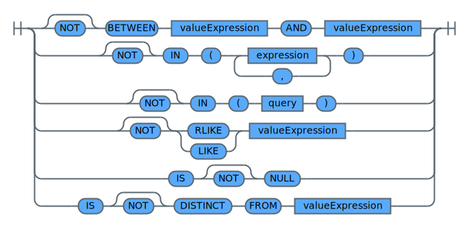
</div>

The `BETWEEN ... AND` predicate compares a value with a range of values. If `NOT` is specified, the result is reversed.

The `IN` predicate compares a value or values with a collection of values. The range of values is either defined by a query or a list of expressions enclosed in parentheses.
The query must identify a number of columns that is the same as the number of expressions specified to the left of the IN keyword.
In addition, the number of elements in the list of expressions must be the same as the number of expressions specified to the left of the IN keyword.
If `NOT` is specified, the result is reversed.

The `LIKE` predicate searches for strings that have a certain pattern. The pattern is specified by a string in which certain characters have a special meaning.
* The underscore character `_` represents any single character.
* The percent sign `%` represents a string of zero or more characters.
* Any other character represents itself. Thus trailing blanks in a pattern are part of the pattern.
If `NOT` is specified, the result is reversed.

The `RLIKE` predicate searches for a regular expression pattern in a string. If the pattern expression is found, the result is true.
If the pattern expression is not found, the result is false. If the value of any of the arguments is null, the result of the RLIKE predicate is unknown.
If `NOT` is specified, the result is reversed.

The regular expression pattern has to be a Java regular expression as defined by Java class `java.util.regex.Pattern`.
Meta characters starting with a `\` have to be escaped for the regular expression to work, for example, use `\\d` instead of `\d`
in a pattern string to represent a digit. Refer to latest Java documentation for more details like supported meta characters, predefined character classes, and so on.

The `IS NULL` predicate tests for null values. The result of a NULL predicate cannot be unknown. If the value of the expression is null, the result is true. If the value is not null, the result is false. If `NOT` is specified, the result is reversed.

The `IS DISTINCT FROM` predicate compares two expressions and evaluates to TRUE if their values are not identical. The result of a DISTINCT predicate cannot be null. If `NOT` is specified, the result is reversed. The result of a DISTINCT predicate depends on whether either or both of its input expressions are null:

| Input expressions | IS DISTINCT FROM | IS NOT DISTINCT FROM |
| :----| :---- | :---- |
| Both inputs are non-null. | Evaluates to TRUE if the inputs are not identical and FALSE if they are. Equivalent to the <> operator. | Evaluates to FALSE if the inputs are not identical and TRUE if they are. Equivalent to the = operator. |
| One input is null. | Evaluates to TRUE. | Evaluates to FALSE. |
| Both inputs are null. | Evaluates to FALSE. | Evaluates to TRUE. |
{: caption="Table 34. NULL Values and DISTINCT Predicate Value" caption-side="top"}


The following DISTINCT predicates are logically equivalent to the corresponding search conditions:

| DISTINCT predicate | Search condition |
| ------------------ | ---------------- |
| value 1 IS NOT DISTINCT FROM value2 | (value1 IS NOT NULL AND value2 IS NOT NULL AND value1 = value 2) OR (value1 IS NULL AND value2 IS NULL) |
| value 1 IS DISTINCT FROM value2 | NOT (value1 IS NOT DISTINCT FROM value2)|
{: caption="Table 35. DISTINCT Predicate and Search Condition" caption-side="top"}


<h4>Examples</h4>

<h5><code>IS DISTINCT FROM</code> Examples</h5>

```sql
-- select all rows with distinct values in column A and B
SELECT * FROM (
    SELECT
        col1 AS a,
        col2  AS b
    FROM VALUES
            (1 , 2),
            (2, 2),
            (null, 2),
            (1, null),
            (2, null),
            (null, null)
) WHERE a IS DISTINCT FROM b
```
{: codeblock}


The result of the example query is shown in the table below.

|A   |B   |
|----|----|
|1   |2   |
|null|2   |
|1   |null|
|2   |null|
{: caption="Table 36. Query result for example 'select all rows with distinct values in column A and B'" caption-side="top"}


```sql
-- all rows having no distinct values in column A and B
SELECT * FROM (
    SELECT
        col1 AS a,
        col2 AS b
    FROM VALUES
            (1, 2),
            (2, 2),
            (null, 2),
            (1, null),
            (2, null),
            (null, null)
) WHERE a IS NOT DISTINCT FROM b
```
{: codeblock}


The result of the example query is shown in the table below.

|A   |B   |
|----|----|
|2   |2   |
|null|null|
{: caption="Table 37. Query result for example 'all rows having no distinct values in column A and B'" caption-side="top"}


<h5><code>BETWEEN ... AND ...</code> Examples</h5>

```sql
-- all employees with a salary between 4000 and 8000
SELECT
    emp.col1 AS emp_id,
    emp.col2 AS salary
FROM VALUES
    (0, 1000),
    (2, 2000),
    (3, 3000),
    (4, 4000),
    (5, 5000),
    (6, 6000),
    (7, null),
    (8, 8000),
    (9,9000) AS emp
WHERE emp.col2 BETWEEN 4000 AND 8000
```
{: codeblock}

The result of the example query is shown in the table below.

|EMP_ID|SALARY|
|------|------|
|4     |4000  |
|5     |5000  |
|6     |6000  |
|8     |8000  |
{: caption="Table 38. Query result for example 'all employees with a salary between 4000 and 8000'" caption-side="top"}


```sql
-- all employees with a salary not between 4000 and 8000
SELECT
    emp.col1 AS emp_id,
    emp.col2 AS salary
FROM VALUES
    (0, 1000),
    (2, 2000),
    (3, 3000),
    (4, 4000),
    (5, 5000),
    (6, 6000),
    (7, null),
    (8, 8000),
    (9,9000) AS emp
WHERE emp.col2 NOT BETWEEN 4000 AND 8000
```
{: codeblock}


The result of the example query is shown in the table below.

|EMP_ID|SALARY|
|------|------|
|0     |1000  |
|2     |2000  |
|3     |3000  |
|9     |9000  |
{: caption="Table 39. Query result for example 'all employees with a salary between 4000 and 8000'" caption-side="top"}


<h5><code>IN</code> Examples</h5>

```sql
-- all employees working in department D01 or D02
SELECT
    emp.col1 AS emp_id,
    emp.col2 AS emp_dept
FROM VALUES
    (0, 'D01'),
    (2, 'C01'),
    (3, 'C02'),
    (4, 'D01'),
    (5, 'D02'),
    (6, 'C01'),
    (7, 'D01'),
    (8, 'C03'),
    (9,'D01') AS emp
WHERE emp.col2 IN ('D01','D02')
```
{: codeblock}

The result of the example query is shown in the table below.

|EMP_ID|EMP_DEPT|
|------|--------|
|0     |D01     |
|4     |D01     |
|5     |D02     |
|7     |D01     |
|9     |D01     |
{: caption="Table 40. Query result for example 'all employees working in department D01 or D02'" caption-side="top"}


```sql
-- all employees that are managing a department
SELECT
    emp.col1 AS emp_id,
    emp.col2 AS emp_dept
FROM VALUES
    (0, 'D01'),
    (2, 'C01'),
    (3, 'C02'),
    (4, 'D01'),
    (5, 'D02'),
    (6, 'C01'),
    (7, 'D01'),
    (8, 'C03'),
    (9,'D01') AS emp
WHERE (emp.col1,emp.col2) IN (
    SELECT
        mgr.col1,
        mgr.col2
    FROM VALUES
        (2, 'C01'),
        (4, 'D01'),
        (5, 'D02') AS mgr
    )
```
{: codeblock}

The result of the example query is shown in the table below.

|EMP_ID|EMP_DEPT|
|------|--------|
|2     |C01     |
|4     |D01     |
|5     |D02     |
{: caption="Table 41. Query result for example 'all employees that are managing a department'" caption-side="top"}


<h5><code>LIKE</code> Examples</h5>

```sql
-- all employess that work in a department that starts with letter C
SELECT
    emp.col1 AS emp_id,
    emp.col2 AS emp_dept
FROM VALUES
        (0, 'D01'),
        (2, 'C01'),
        (3, 'C02'),
        (4, 'D01'),
        (5, 'D02'),
        (6, 'C01'),
        (7, 'D01'),
        (8, 'C03'),
        (9, 'D01') AS emp
WHERE emp.col2 LIKE 'C%'
```
{: codeblock}

The result of the example query is shown in the table below.

|EMP_ID|EMP_DEPT|
|------|--------|
|2     |C01     |
|3     |C02     |
|6     |C01     |
|8     |C03     |
{: caption="Table 42. Query result for example 'all employees that work in a department that starts with letter C'" caption-side="top"}


```sql
-- all department names that do not start with letter C
SELECT
    DISTINCT emp.col2 AS emp_dept
FROM VALUES
    (0, 'D01'),
    (2, 'C01'),
    (3, 'C02'),
    (4, 'D01'),
    (5, 'D02'),
    (6, 'C01'),
    (7, 'D01'),
    (8, 'C03'),
    (9,'D01') AS emp
WHERE emp.col2 NOT LIKE 'C%'
```
{: codeblock}

The result of the example query is shown in the table below.

|EMP_DEPT|
|--------|
|D01     |
|D02     |
{: caption="Table 43. Query result for example 'all department names that do not start with letter C'" caption-side="top"}


<h5><code>RLIKE</code> Examples</h5>

```sql
-- all rows that contain in col2 a value ending with 'bc'
SELECT *
FROM VALUES
    (0, 'Abc'),
    (1, 'xyz abc'),
    (2, 'abcabcabc'),
    (3, 'abc xyzxyz abc'),
    (4, '123 456 789') AS data
WHERE data.col2 RLIKE 'bc$'
```
{: codeblock}

The result of the example query is shown in the table below.

|COL1|COL2          |
|----|--------------|
|0   |Abc           |
|1   |xyz abc       |
|2   |abcabcabc     |
|3   |abc xyzxyz abc|
{: caption="Table 44. Query result for example 'all rows that contain in col2 a value ending with bc'" caption-side="top"}


```sql
-- all rows that contain in col2 a sequence of 3 'abc' string occurrences
SELECT *
FROM VALUES
    (0, 'Abc'),
    (1, 'xyz abc'),
    (2, 'abcabcabc'),
    (3, 'abc xyzxyz abc'),
    (4, '123 456 789') AS data
WHERE data.col2 RLIKE '(abc){3}'
```
{: codeblock}


The result of the example query is shown in the table below.

|COL1|COL2     |
|----|---------|
|2   |abcabcabc|
{: caption="Table 45. Query result for example 'all rows that contain in col2 a sequence of 3 abc string occurrences'" caption-side="top"}


```sql
-- all rows that contain in col2 a sequence of integer values (3 digits) separated by blank or tab
SELECT *
FROM VALUES
        (0, 'Abc'),
        (1, 'xyz abc'),
        (2, 'abcabcabc'),
        (3, 'abc xyzxyz abc'),
        (4, '123\t456 789') AS data
WHERE data.col2 RLIKE '\\d{3}[ \\t]\\d{3}[ \\t]\\d{3}'
```
{: codeblock}

The result of the example query is shown in the table below.

|COL1|COL2       |
|----|-----------|
|4   |123 456 789|
{: caption="Table 46. Query result for example 'all rows that contain in col2 a sequence of integer values (3 digits) separated by blank or tab'" caption-side="top"}


<h5><code>IS NULL</code> Examples</h5>

```sql
--- all employees with missing salary information
SELECT
    emp.col1 AS emp_id,
    emp.col2 AS salary
FROM VALUES
    (0, 1000),
    (2, 2000),
    (3, 3000),
    (4, 4000),
    (5, 5000),
    (6, 6000),
    (7, NULL),
    (8, 8000),
    (9,9000) AS emp
WHERE emp.col2 IS NULL
```
{: codeblock}


The result of the example query is shown in the table below.

|EMP_ID|SALARY|
|------|------|
|7     |null  |
{: caption="Table 47. Query result for example 'all employees with missing salary information'" caption-side="top"}


<h3>Cast Expression</h3>

The syntax of a *cast expression* is described by the syntax diagrams below.

The cast specification returns the cast operand (the first operand) cast to the type specified by the data type.

If the specified data type is not supported, an error is returned.

<h4 id="castExpression">castExpression</h4>

<div style="overflow-x : auto;">
<map name="castExpressionImgMap">
	<area alt="section expression" shape="rect" coords="170,20,270,42" href="#expression" />
	<area alt="section dataType" shape="rect" coords="346,20,430,42" href="#dataType" />
</map>

</div>

Note that in case an expression cannot be casted to the data type specified in the cast expression, the expression result is `null`.

<h4 id="dataType">dataType</h4>

<div style="overflow-x : auto;">
<map name="dataTypeImgMap">
	<area alt="section dataType" shape="rect" coords="286,20,370,42" href="#dataType" />
	<area alt="section dataType" shape="rect" coords="202,50,286,72" href="#dataType" />
	<area alt="section dataType" shape="rect" coords="354,50,438,72" href="#dataType" />
	<area alt="section complexColTypeList" shape="rect" coords="250,90,414,112" href="#complexColTypeList" />
	<area alt="section identifier" shape="rect" coords="70,160,170,182" href="#identifier" />
	<area alt="section unsignedInteger" shape="rect" coords="278,160,418,182" href="#unsignedInteger" />
</map>

</div>

An `identifier` in a cast expression can have the values listed below.

<h5>Numeric Types</h5>

Numeric data types are summarized in the table below.

| Identifier | Type | Bytes | Minimum Value | Maximum Value |
| :---- | :----: | :----: | :----: | :----: |
| `TINYINT` | signed integer | 1 | -128 | 127 |
| `SMALLINT` | signed integer | 2 | -32768 | 32767 |
| `INT` | signed integer | 4 | -2147483648 | 2147483647 |
| `INTEGER` | signed integer | 4 | -2147483648 | 2147483647 |
| `BIGINT` | signed integer | 8 | -9223372036854775808 | 9223372036854775807 |
| `FLOAT` | single precision floating point number | 4 | n/a | n/a |
| `DOUBLE` | double precision floating point number | 8 | n/a | n/a |
| `DOUBLE PRECISION` | double precision floating point number | 8 | n/a | n/a |
| `DECIMAL` | precision of 38 digits | n/a | -10e37+1 | 10e37-1 |
{: caption="Table 48. Numeric Data Types" caption-side="top"}


<h5>String Types</h5>

Supported string type identifiers are `VARCHAR` and `CHAR`.

<h5>Date and Time Types</h5>

String values with appropriate formats can be converted to a timestamp or date, using data type `TIMESTAMP` or `DATE`, respectively.

```sql
-- cast string values to timestamp and date types
SELECT
    CAST('2018-10-31 23:55:00' AS TIMESTAMP),
    CAST('2018-10-31 23:55:00' AS DATE),
    CAST('HELLO' AS TIMESTAMP)
FROM VALUES ('dummy')
```
{: codeblock}


The result of the example query is shown in the table below.

|CAST(2018-10-31 23:55:00 AS TIMESTAMP)|CAST(2018-2-28 23:55:00 AS DATE)|CAST(HELLO AS TIMESTAMP)|
|--------------------------------------|--------------------------------|------------------------|
|2018-10-31 23:55:00.0                 |2018-02-28                      |null                    |
{: caption="Table 49. Query result for example 'cast string values to TIMESTAMP and DATE types'" caption-side="top"}


<h5>Misc Types</h5>

<h6>Boolean Type</h6>

The `BOOLEAN` type represents a domain with two values, `true` or `false`.

Any numeric value representing zero, for example, `0`, `0.0`, or `0.0E10`, can be casted to `false`.

Numeric values representing a nonzero value, for example, 1, 1.0, 1.0E10, or 21474.83648 can be casted to `true`.

The string value `'0'` can be casted to `false` and `'1'` can be casted to `true`, respectively. Any other string value is casted to `false`.

<h6>Binary Type</h6>

A `BINARY` type represents an array of byte values. Thus, string values can be casted to type `BINARY`.

<h4 id="complexColTypeList">complexColTypeList</h4>

<div style="overflow-x : auto;">
<map name="complexColTypeListImgMap">
	<area alt="section complexColType" shape="rect" coords="70,20,202,42" href="#complexColType" />
</map>

</div>

<h4 id="complexColType">complexColType</h4>

<div style="overflow-x : auto;">
<map name="complexColTypeImgMap">
	<area alt="section identifier" shape="rect" coords="50,30,150,52" href="#identifier" />
	<area alt="section dataType" shape="rect" coords="218,30,302,52" href="#dataType" />
	<area alt="section STRING" shape="rect" coords="438,30,506,52" href="#STRING" />
</map>
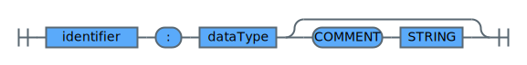
</div>

<h4>More Topics</h4>

For further details about the clauses used by a *cast expression*, refer to the following topics:
* [expression](#expression)
* [identifier](#identifier),
* [STRING](#STRING)
* [unsignedInteger](#unsignedInteger)

<h4>Related References</h4>

A *cast expression* is referenced by the following clause:
* [primaryExpression](#primaryExpression)

<h3>Case Expressions</h3>

A case expression allows an expression to be selected based on the evaluation of one or more conditions.

The syntax of a case expression is described by the syntax diagrams below.

<h4 id="caseExpression">caseExpression</h4>

<div style="overflow-x : auto;">
<map name="caseExpressionImgMap">
	<area alt="section whenClause" shape="rect" coords="212,30,312,52" href="#whenClause" />
	<area alt="section expression" shape="rect" coords="434,30,534,52" href="#expression" />
	<area alt="section expression" shape="rect" coords="142,79,242,101" href="#expression" />
	<area alt="section whenClause" shape="rect" coords="272,79,372,101" href="#whenClause" />
	<area alt="section expression" shape="rect" coords="494,79,594,101" href="#expression" />
</map>

</div>

The upper path in the syntax diagram represents a *searched when clause*, that is, the `WHEN` keyword follows directly after the `CASE` keyword.
The lower path is a *simple when clause*, that is, an expression follows after the `CASE` keyword.

In general, the value of the case expression is the value of the *result expression*, following the first (leftmost) case that evaluates to true.
If no case evaluates to true and the ELSE keyword is present, the result is the value of the ELSE case result expression.
If no case evaluates to true and the ELSE keyword is not present, the result is NULL. Note that when a case evaluates to unknown (because of NULLs), the case is not true and hence is treated the same way as a case that evaluates to false.

When using the *simple when clause*, the value of the expression before the first WHEN keyword is tested for equality with the value of the expression following the WHEN keyword. The data type of the expression before the first WHEN keyword must therefore be comparable to the data types of each expression following the WHEN keyword(s).

A *result expression* is an expression following the `THEN` or `ELSE` keywords.

<h4 id="whenClause">whenClause</h4>

<div style="overflow-x : auto;">
<map name="whenClauseImgMap">
	<area alt="section expression" shape="rect" coords="122,20,222,42" href="#expression" />
	<area alt="section expression" shape="rect" coords="314,20,414,42" href="#expression" />
</map>

</div>

<h4>Examples</h4>

```sql
-- simple case expression with no ELSE clause
SELECT
    dep.col1 AS dep_id,
    CASE dep.col2
        WHEN 'A' THEN 'Administration'
        WHEN 'B' THEN 'Human Resource'
        WHEN 'C' THEN 'Development'
    END AS dep_name
FROM VALUES (0, 'A'), (1, 'B'), (2, 'C'), (3, 'D'), (4, 'E') AS dep
```
{: codeblock}

The result of the example query is shown in the table below.

|DEP_ID|DEP_NAME      |
|------|--------------|
|0     |Administration|
|1     |Human Resource|
|2     |Development   |
|3     |null          |
|4     |null          |
{: caption="Table 50. Query result for example 'simple case expression with no ELSE clause'" caption-side="top"}


```sql
-- simple case expression with ELSE clause
SELECT
    dep.col1 AS dep_id,
    CASE dep.col2
        WHEN 'A' THEN 'Administration'
        WHEN 'B' THEN 'Human Resource'
        WHEN 'C' THEN 'Development'
        ELSE 'UNKOWN'
    END AS dep_name
FROM VALUES (0, 'A'), (1, 'B'), (2, 'C'), (3, 'D'), (4, 'E') AS dep
```
{: codeblock}


The result of the example query is shown in the table below.

|DEP_ID|DEP_NAME      |
|------|--------------|
|0     |Administration|
|1     |Human Resource|
|2     |Development   |
|3     |UNKOWN        |
|4     |UNKOWN        |
{: caption="Table 51. Query result for example 'simple case expression with ELSE clause'" caption-side="top"}


There are two scalar functions, `NULLIF()` and `COALESCE()`, that are specialized to handle a subset of the functionality provided by `CASE`.

| Expression | Equivalent Expression |
| ---------- | --------------------- |
| CASE WHEN e1=e2 THEN NULL ELSE e1 END | NULLIF(e1,e2) |
| CASE WHEN e1 IS NOT NULL THEN e1 ELSE e2 END| COALESCE(e1,e2) |
| CASE WHEN e1 IS NOT NULL THEN e1 ELSE COALESCE(e2,...,eN) END| COALESCE(e1,e2,...,eN)|
{: caption="Table 52. CASE, NULLIF(), and COALESCE()" caption-side="top"}


Refer to the section about [SQL functions](/docs/services/sql-query?topic=sql-query-sqlfunctions#sqlfunctions) for more details.

For further details about the clauses used by a *case expression*, refer to the following topic:
* [expression](#expression)

<h4>Related References</h4>

A *case expression* is referenced by the following clause:
* [primaryExpression](#primaryExpression)

### Operator
{: #chapterOperator}

The following types of operators can be used:
* [Unary](#unaryOperator)
* [Aithmetic](#arithmeticOperator)
* [String](#stringOperator)
* [Comparison](#comparisonOperator)
* [Boolean](#booleanOperator)

<h3 id="unaryOperator">Unary operators</h3>

| Operator | Operand types | Description |
| :----: | ---- | ---- |
| `-A` | All number types | Unary negative operator. The type of the result is the same as the type of A. |
| `+A` | All number types | Unary positive operator. The type of the result is the same as the type of A. |
| `~A` | All number types | Bitwise NOT operator. The type of the result is the same as the type of A. |
{: caption="Table 53. Unary operators" caption-side="top"}


<h3 id="arithmeticOperator">Arithmetic operators</h3>

| Operator | Operand types | Description |
| :----: | ---- | ---- |
| `A + B`   | All number types | Returns the result of adding A and B. The type of the result is the same as the type of the operand that is highest in the type hierarchy. For example, if A is of type FLOAT and B is of type INT, the result is of type FLOAT. |
| `A - B`   | All number types | Returns the result of subtracting B from A. The type of the result is the same as the type of the operand that is highest in the type hierarchy. For example, if A is of type FLOAT and B is of type INT, the result is of type FLOAT. |
| `A * B`   | All number types | Returns the result of multiplying A and B. The type of the result is the same as the type of the operand that is highest in the type hierarchy. For example, if A is of type FLOAT and B is of type INT, the result is of type FLOAT. If the operation causes an overflow, cast at least one of the operators to a type that is higher in the type hierarchy. |
| `A / B`   | All number types | Returns the result of dividing A by B. The type of the result is DOUBLE. |
| `A % B`   | All number types | Returns the reminder after dividing A by B.  For example, 13.7 % 3 returns 1.7. The type of the result is the same as the type of the operand that is highest in the type hierarchy. For example, if A is of type FLOAT and B is of type INT, the result is of type FLOAT. |
| `A DIV B` | Integer types    | Returns the integer part of the result of dividing A by B. For example, 13.7 DIV 3 returns the integer 4. |
| `A & B`   | All number types | Returns the result of bitwise AND of A and B. The type of the result is the same as the type of the operand that is highest in the type hierarchy. |
| <code>A &#124; B</code> | All number types | Returns the result of bitwise OR of A and B. The type of the result is the same as the type of the operand that is highest in the type hierarchy. |
| `A ^ B`  | All number types | Returns the result of bitwise XOR of A and B. The type of the result is the same as the type of the operand that is highest in the type hierarchy. |
{: caption="Table 54. Arithmetic operators" caption-side="top"}


<h3 id="stringOperator">String operator</h3>

| Operator | Operand types | Description |
| :----: | ---- | ---- |
| <code>A &#124;&#124; B</code> |  All types | Returns the concatenation of A and B. If A or B is not a string, it is first converted into a string type. The result is a string. |
{: caption="Table 55. String operator" caption-side="top"}


<h3 id="comparisonOperator">Comparison operators</h3>

| Operator | Operand types | Description |
| :----: | ---- | ---- |
| `A = B` | All primitive types | Returns TRUE if A is equal to B; FALSE otherwise. |
| `A == B`| All primitive types| Synonym for the equal (=) operator. |
| `A <> B` | All primitive types| Returns NULL if A or B is NULL; TRUE if A is not equal to B; FALSE otherwise. |
| `A != B` | All primitive types| Synonym for the not equal (<>) operator.|
| `A < B` | All primitive types| Returns NULL if A or B is NULL; TRUE if A is less than B; FALSE otherwise. |
| `A <= B` | All primitive types| Returns NULL if A or B is NULL; TRUE if A is less than or equal to B; FALSE otherwise. |
| `A !> B` | All primitive types| Returns NULL if A or B is NULL; TRUE if A is not greater than B; FALSE otherwise. |
| `A > B` | All primitive types| Returns NULL if A or B is NULL; TRUE if A is greater than B; FALSE otherwise. |
| `A >= B` |All primitive types | Returns NULL if A or B is NULL; TRUE if A is greater than or equal to B; FALSE otherwise. |
| `A !< B` | All primitive types| Returns NULL if A or B is NULL; TRUE if A is not less than B; FALSE otherwise.|
| `A <=> B` | All primitive types| Returns the same result as the equal (=) operator if both A and B are not NULL; TRUE if both A and B are NULL; FALSE if A or B (but not both) is NULL.|
{: caption="Table 56. Comparison operators" caption-side="top"}


<h3 id="booleanOperator">Boolean operators</h3>

| Operator | Operand types | Description |
| :----: | ---- | ---- |
| `NOT A` | Boolean expressions | TRUE if A is FALSE; FALSE otherwise. |
| `A AND B` | Boolean expressions | TRUE if A and B are both TRUE; FALSE otherwise. |
| `A OR B` | Boolean expressions | FALSE if A and B are both FALSE; TRUE otherwise. |
{: caption="Table 57. Boolean operators" caption-side="top"}


<h3>Related References</h3>

An *operator* is referenced by [valueExpression](#valueExpression).

## Catalog Management 
{: #chapterHiveCatalog}

The following commands allow users to store table metadata catalog in the {{site.data.keyword.sqlquery_short}} catalog. Having the tables, columns, and partitions defined in the catalog allows you to use short table names in the SQL SELECT statements. Each instance of {{site.data.keyword.sqlquery_short}} has its own catalog, and table definitions are not visible from other instances.
Refer to the section about [Catalog Management (/docs/services/sql-query?topic=sql-query-hivemetastore) for more details.

### Create Table
{: #chapterCreateTable}

<h4 id="createTable">createTable</h4>

<div style="overflow-x : auto;">
<map name="createTableImgMap">
	<area alt="section tableIdentifier" shape="rect" coords="51,104,191,126" href="#tableIdentifier" />
	<area alt="section columnDefinition" shape="rect" coords="299,104,447,126" href="#columnDefinition" />
	<area alt="section identifier" shape="rect" coords="323,372,423,394" href="#identifier" />
	<area alt="section COSURI" shape="rect" coords="155,467,223,489" href="#COSURI" />
</map>
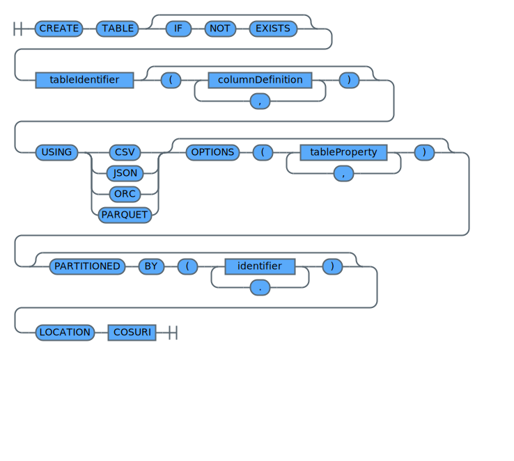
</div>

<h4 id="columnDefinition">columnDefinition</h4>

<div style="overflow-x : auto;">
<map name="columnDefinitionImgMap">
	<area alt="section identifier" shape="rect" coords="50,20,150,42" href="#identifier" />
	<area alt="section dataType" shape="rect" coords="170,20,254,42" href="#dataType" />
</map>
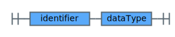
</div>

Create a table definition in the catalogbased on the objects in the specified {{site.data.keyword.cos_short}} location. The *LOCATION* option is mandatory.
If a table with the same name already exists in the same {{site.data.keyword.sqlquery_short}} instance, an error is returned, unless the *IF NOT EXISTS* clause is specified.

The column and partition definitions are optional. If they are not provided, the table schema and partitioning is detected from the structure of the data at the given location.
If you explicitly provide these definitions, ensure that they match the objects stored in {{site.data.keyword.cos_short}}.

```sql
-- create a definition for the table customer
CREATE TABLE customers (
  customerID string,
  companyName string,
  contactName string,
  contactTitle string,
  address string,
  region string,
  postalCode string,
  country string,
  phone string,
  fax string
)
USING CSV
location  cos://us-geo/sql/customers.csv
```
{: codeblock}

Before you can use a newly created *PARTITIONED* table definition, you have to call *ALTER TABLE tablename RECOVER PARTITIONS*. Otherwise, an empty result is returned when doing a SELECT statement on this table.

```sql
-- create a definition for the table customers_partitioned
CREATE TABLE customers_partitioned (
  customerID string,
  companyName string,
  contactName string,
  contactTitle string,
  address string,
  region string,
  postalCode string,
  country string,
  phone string,
  fax string
)
USING CSV
PARTITIONED BY (COUNTRY)
location  cos://us-geo/sql/customers_partitioned.csv

-- attach table partitions by scanning the location of the table
ALTER TABLE customers_partitioned RECOVER PARTITIONS
```
{: codeblock}

An alternative way to create a table definition is to use the automatic schema detection where you do not need to specify any columns.

```sql
-- create a definition for the table shippers with automatic schema detection
CREATE TABLE shippers
USING parquet
location  cos://us-geo/sql/shippers.parquet
```
{: codeblock}


### Drop Table
{: #chapterDropTable}

<h4 id="dropTable">dropTable</h4>

<div style="overflow-x : auto;">
<map name="dropTableImgMap">
	<area alt="section tableIdentifier" shape="rect" coords="386,30,526,52" href="#tableIdentifier" />
</map>
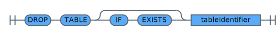
</div>

Drop a table definition from the catalog. If the table does not exist, you receive an error, unless the *IF EXISTS* options is specified.

Note: This command does not delete any data in {{site.data.keyword.cos_short}}. It only removes the table definition from the catalog.

```sql
-- drop a definition for the table customer
DROP TABLE customers
```
{: codeblock}

### Alter Table Partitions
{: #chapterAlterTable}

<h4 id="alterTablePartitions">alterTablePartitions</h4>

<div style="overflow-x : auto;">
<map name="alterTablePartitionsImgMap">
	<area alt="section tableIdentifier" shape="rect" coords="210,20,350,42" href="#tableIdentifier" />
	<area alt="section partitionSpec" shape="rect" coords="722,60,846,82" href="#partitionSpec" />
	<area alt="section COSURI" shape="rect" coords="990,60,1058,82" href="#COSURI" />
	<area alt="section partitionSpec" shape="rect" coords="810,109,934,131" href="#partitionSpec" />
</map>
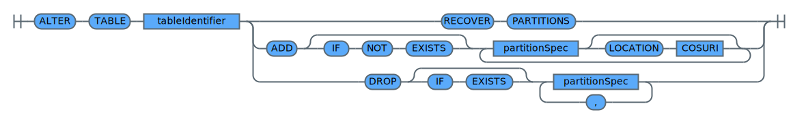
</div>

Use alter table to modify the definition of the partitions or to automatically discover the available partitions.

Use the below *RECOVER PARTITIONS* option to automatically replace the table partition metadata with the structure detected from {{site.data.keyword.cos_short}} data using the location prefix specified for the table.

```sql
-- replace the table partitions by scanning the location of the table
ALTER TABLE customers_partitioned RECOVER PARTITIONS
```
{: codeblock}

<h4 id="partitionSpec">partitionSpecification</h4>

<div style="overflow-x : auto;">
<map name="partitionSpecImgMap">
	<area alt="section identifier" shape="rect" coords="230,20,330,42" href="#identifier" />
	<area alt="section constant" shape="rect" coords="398,20,482,42" href="#constant" />
</map>
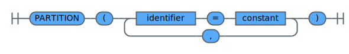
</div>


In order to add or remove partitions manually, use the *ADD* or *DROP* syntax. *ALTER TABLE* does not validate the specified location.

```sql
-- alter the table partitions by adding a partition
ALTER TABLE customers_partitioned ADD IF NOT EXISTS PARTITION ( COUNTRY = 'Spain') LOCATION cos://us-geo/sql/customers_partitioned.csv/COUNTRY=Spain
-- alter the table partitions by dropping a partition
ALTER TABLE customers_partitioned DROP IF EXISTS PARTITION ( COUNTRY = 'Nowhere')
```
{: codeblock}

Use the *EXISTS* options to avoid getting errors during *ADD* or *DROP*.

<!-- HIDE START ### Set partition location

To change a partition definition, use the *SET* option.

```sql
-- alter the table partitions definition
ALTER TABLE customers_partitioned PARTITION ( COUNTRY = 'Spain') SET LOCATION cos://us-geo/sql/customers_partitioned.csv/COUNTRY=Spain
```
{: codeblock}
HIDE END -->

<!-- HIDE START ### Analyze Table

<h4 id="analyzeTable">Analyze Table</h4>

*!-- include-svg src="./svgfiles/analyzeTable.svg" target="./diagrams/analyzeTable.svg" alt="syntax diagram for a analyze table command" layout="@break@" --*

The ANALYZE TABLE command collect statistics about the specified table and for the specified columns. This information can be used for the query optimizer to identify the optimal query plan. For example, to decide which table is smaller when using a broadcast hash join, add those columns that are used in the SELECT statements.

```sql
-- analyze statistics for the table customer without scanning each object
analyze table customer compute STATISTICS NOSCAN
```
{: codeblock}

The option *NOSCAN* only collects the bytes of the objects. HIDE END -->

### Describe Table
{: #chapterDescribeTable}

<h4 id="describeTable">describeTable</h4>

<div style="overflow-x : auto;">
<map name="describeTableImgMap">
	<area alt="section tableIdentifier" shape="rect" coords="234,30,374,52" href="#tableIdentifier" />
	<area alt="section partitionSpec" shape="rect" coords="404,30,528,52" href="#partitionSpec" />
	<area alt="section identifier" shape="rect" coords="598,30,698,52" href="#identifier" />
</map>
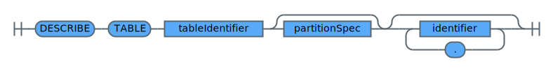
</div>

Return the schema (column names, data types, and comments) of a table definition. If the table does not exist, an error is returned.

```sql
-- returns detailed information about the customer table
DESCRIBE TABLE  customers_partitioned
```
{: codeblock}

### Show Tables
{: #chapterShowTables}

<h4 id="showTables">showTables</h4>

<div style="overflow-x : auto;">
<map name="showTablesImgMap">
	<area alt="section STRING" shape="rect" coords="322,40,390,62" href="#STRING" />
</map>
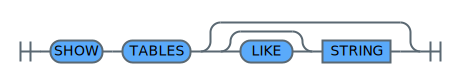
</div>

Returns the list of the defined tables in the catalog. *LIKE STRING* allows to filter for a given pattern. `*` can be used as wildcard character.

```sql
-- returns all defined tables in the catalogfor this instance
SHOW TABLES
```
{: codeblock}

<!-- HIDE START ### Show Table Properties

<h4 id="showTblProperties">Show Table Properties</h4>

*!--  include-svg src="./svgfiles/showTblProperties.svg" target="./diagrams/showTblProperties.svg" alt="syntax diagram for show table properties" layout="@break@" --*

<h4 id="tableProperty">Table Property</h4>

*!--  include-svg src="./svgfiles/tableProperty.svg" target="./diagrams/tableProperty.svg" alt="syntax diagram for table properties" layout="@break@" --*

*!--  include-svg src="./svgfiles/tablePropertyKey.svg" target="./diagrams/tablePropertyKey.svg" alt="syntax diagram for table properties" layout="@break@" --*


Return either all properties of a table definition or a specific property. An error is returned if the table does not exist.

```sql
-- returns all specified table options for the table customer
SHOW TBLPROPERTIES customer
```
{: codeblock} HIDE END -->

### Show Partitions
{: #chapterShowPartitions}

<h4 id="showPartitions">showPartitions</h4>

<div style="overflow-x : auto;">
<map name="showPartitionsImgMap">
	<area alt="section tableIdentifier" shape="rect" coords="242,30,382,52" href="#tableIdentifier" />
	<area alt="section partitionSpec" shape="rect" coords="412,30,536,52" href="#partitionSpec" />
</map>
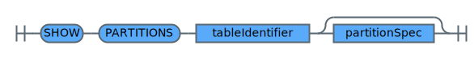
</div>

List the defined partitions of a table when a table has been created as partitioned. You can filter the returned partitions using the *partitionSpec* option.


```sql
-- returns all partitions for the table customers_partitioned
SHOW PARTITIONS customers_partitioned
```
{: codeblock}

## Miscellaneous Definitions
{: #chapterMiscDefinitions}

<h3 id ="COSURI">COSURI</h3>

A Cloud {{site.data.keyword.cos_short}} Uniform Resource Identifier (COS URI) is a string of characters that uniquely identifies an object on Cloud {{site.data.keyword.cos_short}}. By definition URIs are case-insensitive.

The syntax of a COS URI is thoroughly described in section [Table unique resource identifier](/docs/services/sql-query?topic=sql-query-overview#table-unique-resource-identifier).

<h3 id ="CRN_URI">CRN_URI</h3>

A database table CRN is a unique identifier consisting of the CRN of a database service instance and a specific table name that instance.
The user must have access to this service instance and its credentials.

The syntax of a table CRN is thoroughly described in section [Table unique resource identifier](/docs/services/sql-query?topic=sql-query-overview#table-unique-resource-identifier).

<h3 id ="DB2_TABLE_URI">DB2_TABLE_URI</h3>

A Db2 table URI is a string of characters that uniquely identifies a table in an {{site.data.keyword.Db2_on_Cloud_long}} and {{site.data.keyword.dashdblong}} instance. The instance must be enabled for IAM and the IBMid of the user must have been added as a database user.

The syntax of a Db2 Table URI is thoroughly described in section [Table unique resource identifier](/docs/services/sql-query?topic=sql-query-overview#table-unique-resource-identifier).

<h3 id="identifier">Identifier</h3>

An *identifier* is a name that uniquely identifies an entity. There are two types of identifiers, unquoted identifiers and backquoted identifiers.

<h4>Unquoted Identifier</h4>

An unquoted identifier is at least one character long. Valid characters that can be used are the following:
* Digits `0-9`
* Letters `a-z`, `A-Z`
* Underscore `_`

<h4>Backquoted Identifier</h4>

This is an identifier that is embraced by grave accent <code>&#96;</code> characters. Backquoted identifier can
contain any character including the grave accent character that has to be escaped like this <code>&#96;&#96;</code>.

The following example shows how to add a column name containing a special character:

```sql
SELECT col1 as `Lösung` FROM VALUES 1, 2 ,3
```

<h3 id="tableIdentifier">Table Identifier</h3>

A *table identifier* uniquely identifies a table in the catalog of the {{site.data.keyword.sqlquery_short}} instance. Valid characters that can be used are the following:
* Digits `0-9`
* Letters `a-z`, `A-Z`
* Underscore `_`

<h3 id="number">Number</h3>

A number is either a signed or unsigned *integer* or a *decimal* number.

<h3 id="unsignedNumber">Unsigned Number</h3>

An unsigned number is an *integer* or *decimal* number without sign or type suffix.

<h3 id="unsignedInteger">Unsigned Integer Number</h3>

An unsigned integer is an *integer* number without sign or type suffix.

<h4 id="INTEGER_VALUE">Integer Number</h4>

An integer number is represented by a sequence of at least one digit, that is, `0` to `9`.
The integer number can have a suffix denoting the type of integer number. There are three types of integer numbers:
* `Y`: tiny integer number
* `S`: small integer number
* `L`: big integer number

See section [dataType](#dataType) for more details about data types.

<h4 id="DECIMAL_VALUE">Decimal Number</h4>

A decimal number is the following:
* A sequence of at least one digit followed by a positive or negative exponent, for example, `10E2` represents integer `1000` and `1E-1` represents 0.1.
* A decimal number, for example, `3.14`.
* A decimal number followed by a positive or negative exponent , for example, `3.14E+3` represents `3140.00` or `3.14E-3` represents `0.00314`.

The decimal number can have a suffix denoting the type of decimal number. There are two types of decimal numbers:
* `D`: double decimal number
* `BD`: big decimal number

See section [dataType](#dataType) for more details about data types.

<h3 id="STRING">String</h3>

A *string* is a sequence of arbitrary characters including escaped characters, for example,
`\t`, either enclosed in single quotes `'`, or double quotes, `"`.
To include any quote characters in the string they have to be escaped as <code>\\\\&#96;</code> or `\\"`, respectively.

